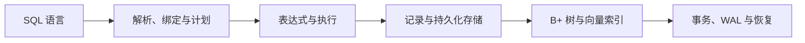

# 设计目标

LiteDB 的立项目标不是重新制造一个功能更多的通用数据库，而是构建一个能够完整展示数据库底层工作方式的现代 C++ 项目。

它试图回答一个学习者经常遇到的问题：

> 数据库的各个知识点都可以单独找到，但如何把它们连接成一个真正能够执行 SQL、保存数据并从崩溃中恢复的系统？

## 整合数据库知识

数据库知识分散在教材、论文、课程、博客与成熟开源系统中。单独学习解析器、B+ 树或 WAL 并不困难，困难的是理解它们在同一系统中的边界和协作顺序。

LiteDB 希望用一条完整主线连接这些主题：

项目不仅展示各模块内部的数据结构，也强调跨模块的责任划分。例如，索引负责组织查询入口，事务层负责集合、索引和元数据之间的跨文件原子提交。

## 从零构建完整主链路

LiteDB 尽量避免把数据库核心行为交给现成数据库库完成。从 SQL 文本到磁盘文件，主要机制都在项目中显式实现：

- 词法与语法分析；
- 名称绑定和类型检查；
- 逻辑、优化与物理计划；
- 表达式求值和执行算子；
- 模式、记录、页面和文件格式；
- 标量与向量索引；
- 事务暂存、redo WAL 和崩溃恢复；
- 客户端、服务端与通信协议。

## 面向学习与教学

项目应当适合：

- 按模块阅读某个数据库主题；
- 沿调用链观察一条 SQL 的完整执行；
- 使用调试器检查计划、页面、索引和 WAL；
- 通过测试复现格式损坏和崩溃边界；
- 在课程、文章或演示中解释系统行为；
- 修改某一层并观察它对上下游的影响。

为此，LiteDB 更偏好明确的分层、稳定的领域对象和可描述的协议，而不是为了减少少量代码而合并语义不同的模块。

## 探索系统底层架构

LiteDB 也是一个数据库架构试验场。它关注的不只是某个算法能否运行，还关注：

- 内存模型与磁盘格式如何对应；
- 元数据、存储和索引分别拥有哪部分状态；
- 错误在哪一层产生，又如何跨层传播；
- durable commit 前后为什么具有不同失败语义；
- 崩溃后哪些内容能够重放，哪些必须重建；
- 新功能应该进入现有边界，还是需要新的抽象。

项目希望保持轻量，但“轻量”指可理解、可编译和可实验，而不是省略所有数据库必要层次。

## 实践现代 C++

LiteDB 使用现代 C++ 构建，希望在真实系统代码中实践：

- 强类型 ID 和领域模型；
- RAII 与所有权表达；
- `std::expected` 风格的显式错误传播；
- `std::variant`、`std::optional` 和范围等标准库能力；
- 移动语义与资源封装；
- 接口分层和组合式设计；
- 面向字节、文件与网络的底层编程；
- 可测试的故障注入和恢复路径。

现代语言特性服务于可读性、正确性与资源安全，而不是为了展示语法本身。

## 模块化与可演进

项目把解析、元数据、模式、存储、索引、事务、网络等能力划分为相对独立的模块。模块化的目标是：

- 让学习者可以局部理解系统；
- 让实现可以分阶段替换；
- 避免一个通用抽象掩盖不同持久化结构的语义；
- 让测试能够覆盖明确的责任边界；
- 为后续加入统计信息、成本优化、MVCC 等能力保留演进空间。

LiteDB 不追求一次设计出最终架构。每一阶段都应先形成可运行、可验证的闭环，再依据真实的重复和约束演进抽象。

## 明确的非目标

当前阶段不以以下事项为首要目标：

- 替代 SQLite、PostgreSQL 等成熟数据库；
- 提供生产级可用性和长期格式兼容；
- 追求完整 SQL 标准覆盖；
- 立即支持高并发、分布式和大规模数据；
- 为基准成绩牺牲实现的可解释性；
- 过早建立尚无实际需求支撑的通用框架。

这些边界使项目能够聚焦于数据库核心知识与系统设计本身。
