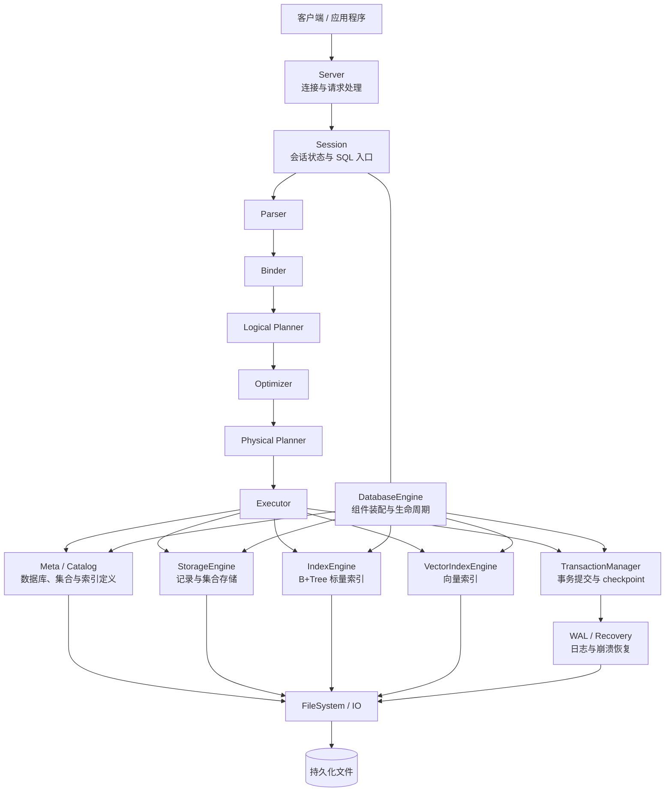

# 整体架构

LiteDB 是一个面向结构化数据与向量检索的轻量级数据库。系统以 SQL 作为统一入口，在同一套执行框架中组织元数据、记录存储、标量索引和向量索引，并通过事务与预写日志（Write-Ahead Logging，WAL）保证多个持久化文件之间的一致性。

本章只介绍系统的主要组件、职责边界和端到端数据流。各组件的内部实现将在后续章节中展开。

## 架构总览

这张图表达的是职责和主要依赖关系，不表示每条 SQL 都会经过所有组件。例如，只读查询不会产生事务写集或 WAL；没有可用索引时，查询也可以直接扫描集合。

## 分层与职责

### 接入与会话

Server 负责接收客户端请求并返回执行结果。每个连接通过 `Session` 保存当前选中的
数据库等会话状态。无论 SQL 来自网络客户端还是进程内调用，核心执行入口都是
`Session::execute_sql`。

`Session` 也是当前的串行化入口：SQL 执行、checkpoint 和相关观测操作共享
`DatabaseEngine` 的互斥边界。因而当前实现采用单写者模型，而不是 MVCC 或细粒度锁。

### SQL 处理流水线

一条 SQL 语句依次经过以下阶段：

1. **Parser**：将 SQL 文本解析为抽象语法树（AST）。
2. **Binder**：结合当前会话和 Catalog 解析名称、类型与对象引用。
3. **Logical Planner**：把绑定后的语句转换为逻辑计划。
4. **Optimizer**：基于规则和元数据改写逻辑计划，例如选择可用索引。
5. **Physical Planner**：生成可以执行的物理计划。
6. **Executor**：执行物理计划，读取数据或构造写操作。

各阶段使用明确的中间表示衔接，使语法分析、语义检查、优化策略和执行机制可以独立演进。

### 数据库引擎

`DatabaseEngine` 是核心组件的装配点和生命周期管理者。它拥有文件系统、Catalog、
存储引擎、两类索引引擎、WAL 和事务管理器，并负责：

- 打开数据库和校验数据库清单；
- 在加载在线状态前执行 WAL 恢复；
- 根据 Catalog 恢复集合及索引的运行时对象；
- 将物理计划分派给执行器或 DDL 处理逻辑；
- 发起手动或基于 WAL 大小的自动 checkpoint；
- 汇总事务、恢复和 checkpoint 的观测信息。

`DatabaseEngine` 负责协调和生命周期，但不取代各子系统的领域职责。例如，
跨文件提交协议由 `TransactionManager` 管理，记录布局由 `StorageEngine` 管理。

### Catalog、存储与索引

- **Meta / Catalog** 保存数据库、集合、字段、标量索引和向量索引的定义，是名称绑定、
  Schema 构造和运行时恢复的依据。
- **StorageEngine** 按集合管理记录文件，并根据集合 Schema 校验和编解码记录。
- **IndexEngine** 管理基于 B+Tree 的标量索引，为等值和范围访问提供有序索引能力。
- **VectorIndexEngine** 管理向量索引，为相似度检索提供独立的索引结构。

Catalog 描述“有哪些对象以及对象如何定义”，存储和索引负责这些对象的运行时状态及
物理数据。Schema 是从 Catalog 派生的记录布局，不是另一份独立的元数据源。

### 事务、WAL 与恢复

当前事务模型是隐式的语句级事务。DDL 或 DML 语句在执行成功时提交，在执行失败时
不会发布部分结果。写事务采用 redo-only WAL 和 no-steal 策略，主要过程如下：

`Commit` 记录持久化之前，事务可以中止并丢弃暂存结果；`Commit` 持久化之后，
事务已经完成逻辑提交，不能再回滚。如果后续文件应用或运行时重载失败，数据库会进入
需要恢复的状态，并在下次打开时根据 WAL 重做已提交写入。

这种协议使一次 DDL 或 DML 可以原子地更新 Catalog、集合文件、标量索引和向量索引，
而不是依赖某个单文件的临时文件替换来实现跨文件原子性。

> 当前暂存以受影响集合为范围，但对单个集合及其索引仍以完整文件为主要单位；
> 它不是页级写时复制，也不代表系统已经具备 Buffer Pool 或页级 WAL。

### 文件系统与持久化

底层 `FileSystem` 和 `FileHandle` 封装平台相关的文件操作，为上层提供创建、读写、
同步、替换和目录操作。上层持久化组件各自维护领域格式，而不是共享一个通用
`Store<T>`：

- `meta.lmeta`：Catalog 快照；
- `collections/<collection-id>.store`：集合记录；
- `indexes/<index-id>.bti`：B+Tree 标量索引；
- `vindexes/vindex_<index-id>.lhnsw`：向量索引；
- `wal/`：WAL 分段文件；
- `.transactions/txn_<transaction-id>/`：事务暂存目录。

这些路径属于当前物理布局，应用程序不应绕过数据库引擎直接修改其中的文件。

## 典型执行路径

### 只读查询

只读查询经过完整的 SQL 处理流水线。Executor 根据物理计划执行集合扫描、索引扫描、
过滤、投影和表达式求值，并把结果返回给 Session。该路径读取在线 Catalog、存储和
索引状态，不写入 WAL。

### 数据修改

`INSERT`、`UPDATE` 和 `DELETE` 先产生语句级写集。`TransactionManager` 在独立暂存
视图中把变更应用到受影响集合及其索引，生成受控的文件写入批次；随后先持久化 WAL
提交记录，再将批次应用到正式文件，最后重载受影响集合的运行时状态。

### DDL

DDL 不直接修改在线 Catalog。系统先从当前 Catalog 快照构造离线结果，在事务暂存区
准备新的 Catalog、集合和索引文件，然后通过与 DML 相同的 WAL 提交边界发布。
这样，Catalog 定义和对应物理文件不会在崩溃后处于彼此矛盾的状态。

### 数据库打开与恢复

数据库打开时，`DatabaseEngine` 先打开 WAL 并执行恢复，再加载 Catalog，最后根据
恢复后的 Catalog 重建 StorageEngine、IndexEngine 和 VectorIndexEngine 的运行时
状态。这个顺序保证内存中的对象视图来自已经恢复完成的持久化状态。

## 当前架构边界

为了准确理解 LiteDB 的现状，需要注意以下边界：

- 事务是隐式的语句级事务，尚不提供显式 `BEGIN`、`COMMIT` 和 `ROLLBACK`。
- 并发控制以数据库级串行化为主，尚未实现 MVCC、细粒度锁或并发写调度。
- 写入采用受影响集合范围的完整文件暂存，并非页级增量提交。
- WAL 用于本地崩溃恢复，不是复制日志或分布式一致性协议。
- `DatabaseEngine` 是组合根，`TransactionManager` 是提交协议的所有者；存储、索引和文件系统仍保持各自清晰的职责边界。
