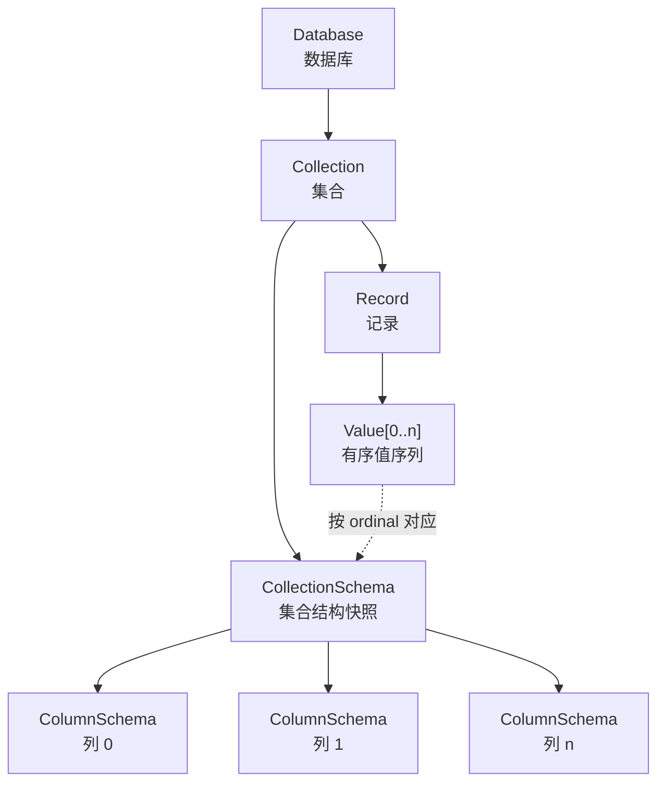
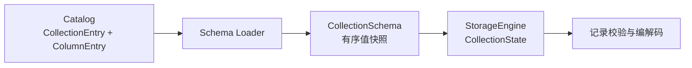

# 数据模型

LiteDB 使用面向集合（Collection）的数据模型。一个数据库包含多个集合，每个集合由固定的 Schema 描述；集合中的每条记录都必须遵循相同的列顺序、逻辑类型和列约束。

## 模型层次



模型中的主要对象如下：

- **Database** 是集合的命名空间。
- **Collection** 是具有固定结构的一组记录，类似关系模型中的表。
- **CollectionSchema** 描述集合身份、名称、注释及有序列集合。
- **ColumnSchema** 描述一列的身份、位置、逻辑类型和列级约束。
- **Record** 由记录 ID 和一组有序值组成。
- **Value** 是记录中一个带有运行时类型的值，也可以表示 `NULL`。

## CollectionSchema

`CollectionSchema` 是一个集合在运行时使用的结构快照，包含：

| 属性 | 含义 |
| --- | --- |
| `database_id` | 所属数据库的稳定内部 ID |
| `collection_id` | 集合的稳定内部 ID |
| `collection_name` | 集合名称 |
| `columns` | 按列序排列的 `ColumnSchema` |
| `comment` | 可选的集合说明 |

名称用于 SQL 和用户展示，内部 ID 用于关联 Catalog、记录文件和索引。重命名等元数据操作不应依赖名称作为物理对象标识。

Schema 中的列是有序的。记录本身存储的是值序列，第 `i` 个值对应 `columns[i]`，因此列序号不仅用于展示，也参与记录校验、编码和解码。

## ColumnSchema

每个 `ColumnSchema` 包含以下信息：

| 属性 | 含义 |
| --- | --- |
| `column_id` | 列的稳定内部 ID |
| `collection_id` | 所属集合 ID |
| `ordinal` | 列在集合中的零起始位置 |
| `column_name` | SQL 中使用的列名 |
| `type` | 列的逻辑类型 |
| `nullable` | 是否允许 `NULL` |
| `unique` | 是否声明为唯一列 |
| `default_expression` | 插入时可使用的默认值表达式 |
| `comment` | 可选的列说明 |

`column_id` 表示列的身份，`ordinal` 表示列在记录布局中的位置，两者用途不同。执行名称绑定时可以按列名查找列；存储记录时则按照 `ordinal` 对齐值与列定义。

## 逻辑类型

Schema 使用逻辑类型描述 SQL 层看到的数据含义。当前支持以下类型：

| 类型 | 参数 | 用途 |
| --- | --- | --- |
| `BOOLEAN` | 无 | 布尔值 |
| `INTEGER` | 无 | 整数 |
| `BIGINT` | 无 | 大整数 |
| `FLOAT` | 无 | 单精度浮点数 |
| `DOUBLE` | 无 | 双精度浮点数 |
| `VARCHAR(n)` | 最大长度 `n` | 字符串 |
| `VECTOR(n)` | 固定维度 `n` | 浮点向量 |

内部类型系统还包含 `NULL`，用于表达式绑定和空值传播；`NULL` 不是创建普通列时使用的独立列类型。

`VARCHAR` 和 `VECTOR` 的参数必须为正数。写入记录时：

- `VARCHAR(n)` 的字符串字节数不能超过 `n`；
- `VECTOR(n)` 的元素数量必须恰好等于 `n`；
- 非空值的运行时类型必须与列的逻辑类型兼容。

更完整的 SQL 类型说明参见 [数据类型](../../sql/data_types/README.md)。

## 列约束

### NULL 与 NOT NULL

`nullable` 决定一列是否接受 `NULL`。插入语句没有为某列提供值时，LiteDB 按以下顺序处理：

1. 如果该列定义了默认值，使用默认值；
2. 否则，如果该列允许为空，填入 `NULL`；
3. 否则，拒绝该插入。

存储引擎在最终写入前还会再次校验非空约束，防止不符合 Schema 的记录进入持久化文件。

### 默认值

Schema 保存的是可持久化的默认值表达式，而不是 Parser 生成的 AST 节点。当前默认值可以表示：

- `NULL`；
- 布尔、整数、浮点数和字符串字面量；
- 由数值字面量组成的向量。

创建集合时，Binder 会检查默认值能否转换为目标列类型；执行 `INSERT` 时，再从 Schema 恢复并求值该默认表达式。

### UNIQUE

列 Schema 可以保存 `UNIQUE` 声明，但**运行时暂未提供唯一性保证**，数据库不会自动为 UNIQUE 列添加索引，也不会在写入时检查唯一性。

## Schema 的来源

Catalog 是数据库结构定义的权威来源。`CollectionSchema` 不单独持久化为第二份 Catalog，而是在打开或重载集合时由 Catalog 条目派生：



Schema Loader 首先找到集合及所属数据库，然后按 Catalog 返回的列顺序构造 `ColumnSchema`，并为每列分配对应的 `ordinal`。

`StorageEngine` 在每个 `CollectionState` 中按值持有 `CollectionSchema`。这样做有两个作用：

- 存储操作不依赖可能因 Catalog 更新而失效的条目指针；
- 一次记录操作始终面对一份稳定、完整的行布局。

当 DDL 提交改变 Catalog 后，相关运行时对象会在事务发布阶段重新加载，使新的 Schema 和新的持久化状态一起生效。

## Schema 与 Catalog 的边界

Schema 是 Catalog 的运行时投影，但两者不是同一个概念：

| Catalog | CollectionSchema |
| --- | --- |
| 保存数据库的完整结构定义 | 只描述一个集合的记录布局 |
| 是元数据的权威来源 | 是从 Catalog 派生的值快照 |
| 包含集合、列和索引条目 | 包含集合信息和有序列定义 |
| 参与 DDL 和持久化 | 服务于绑定、校验、编解码和运行时访问 |

标量索引和向量索引不属于 `CollectionSchema`。它们具有自己的 ID、名称、目标列和算法参数，并由 Catalog 中的 `IndexEntry`、`VectorIndexEntry` 以及对应索引引擎管理。优化器需要索引信息时直接查询 Catalog，而不是从行布局中反向推导。

保持这一边界可以避免以下问题：

- Schema 变成 Catalog 的不完整副本；
- 创建或删除索引迫使记录布局发生无意义变化；
- 存储引擎承担索引生命周期和优化器元数据职责；
- 标量索引与向量索引的领域参数被塞入通用列模型。

## 记录校验

在插入或更新记录之前，存储引擎根据 Schema 执行最终校验：

1. 值数量必须等于 Schema 的列数量；
2. 第 `i` 个值必须对应第 `i` 个 `ColumnSchema`；
3. `NULL` 只能写入允许为空的列；
4. 非空值必须匹配列的逻辑类型；
5. 字符串的字节数不能超过 `VARCHAR(n)` 的长度上限；
6. 向量维度必须等于 `VECTOR(n)` 的维度；
7. 编码后的整条记录必须能容纳在存储页允许的记录空间内。

Binder 的类型检查负责尽早向用户报告 SQL 语义错误，StorageEngine 的校验则构成写入持久化格式前的最后一道结构边界。二者职责互补，不能只依赖其中一层。

## 示例

下面的集合定义描述一组文档及其向量表示：

```sql
CREATE COLLECTION documents (
    id BIGINT NOT NULL,
    title VARCHAR(200) NOT NULL,
    published BOOLEAN DEFAULT false,
    embedding VECTOR(384)
);
```

它对应的行布局可以概括为：

| ordinal | 列 | 类型 | 可空 | 默认值 |
| ---: | --- | --- | --- | --- |
| 0 | `id` | `BIGINT` | 否 | 无 |
| 1 | `title` | `VARCHAR(200)` | 否 | 无 |
| 2 | `published` | `BOOLEAN` | 是 | `false` |
| 3 | `embedding` | `VECTOR(384)` | 是 | 无 |

例如只提供 `id` 和 `title` 时，`published` 使用默认值 `false`，`embedding` 填入 `NULL`；如果提供的向量不是 384 维，语句会在类型绑定或写入校验阶段被拒绝。

## 当前边界

- 集合采用固定的有序列布局，不支持单条记录拥有任意字段集合。
- 当前没有公开的 `ALTER COLLECTION` Schema 演进流程。
- Schema 更新通过 Catalog DDL 和事务发布生效，不允许直接修改存储文件。
- `CollectionSchema` 不包含索引定义；索引属于独立的 Catalog 和运行时对象。
- `UNIQUE` 可以被 Schema 表达，但当前尚未完整落实为写入时的唯一性保证。
