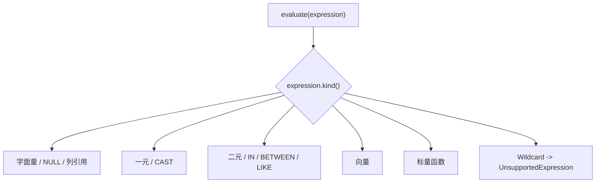
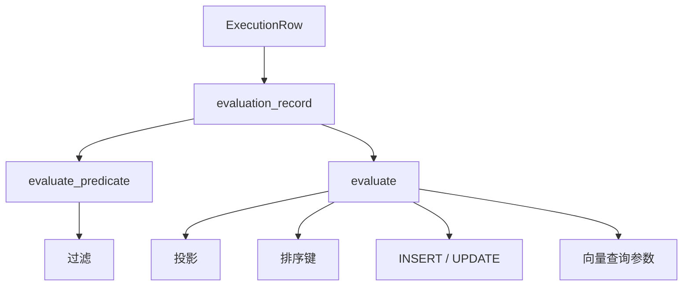

# 求值器与执行流程

`ExpressionEvaluator` 是绑定表达式到运行时值的统一入口。它自身不保存查询状态；每次调用都会创建一个引用当前记录的 `EvaluationWorker`，再递归遍历表达式树。

## 公共接口

求值器提供两个入口：

```cpp
evaluate(expression, record) -> expected<Value, EvaluationError>

evaluate_predicate(expression, record) -> expected<bool, EvaluationError>
```

`evaluate` 返回表达式的原始值。`evaluate_predicate` 在求值后执行谓词检查：

- `BOOLEAN true` 返回 `true`；
- `BOOLEAN false` 返回 `false`；
- `NULL` 返回 `false`；
- 其他运行时类型返回 `InvalidType`。

## 递归分派

`EvaluationWorker::evaluate` 根据节点的 `BoundExpressionKind` 分派：



叶子节点直接生成或读取值；复合节点先递归求值子表达式，再执行对应操作。遇到任一子表达式错误时，错误沿调用链向上返回。

## 叶子表达式

### 字面量

Binder 已经根据 Token 决定字面量逻辑类型：

| SQL 字面量 | 绑定类型 |
| --- | --- |
| `TRUE`、`FALSE` | `BOOLEAN` |
| 整数字面量 | `INTEGER` |
| 浮点字面量 | `DOUBLE` |
| 字符串字面量 | `VARCHAR` |
| `NULL` | `NULL` |

Evaluator 将节点保存的文本解析为对应的运行时值。无效文本、范围错误或不支持的字面量类型返回 `InvalidLiteral`。向量不作为普通 Literal 解析，而由 `BoundVectorExpression` 表示。

### 列引用

绑定后的列引用已经包含数据库、集合、列 ID、列名、类型和可空信息。求值器只使用列 ID 从当前 `Record` 中取值：

```text
record.data.values[column_id - 1]
```

列 ID 为零或超出记录值数组范围时返回 `InvalidColumnReference`。求值阶段不再通过列名查询 Catalog。

## 复合表达式

### 一元和二元节点

一元节点先计算操作数，再执行 `NOT`、一元正号或一元负号。

二元节点当前按以下顺序执行：

1. 计算左操作数；
2. 计算右操作数；
3. 根据操作符执行逻辑、比较或算术运算。

因此，即使左侧已经足以决定 `AND` 或 `OR` 的结果，右侧仍会被计算。文档和上层代码不能依赖短路副作用或用短路规避右侧错误。

### IN

`IN` 先求目标表达式，再按顺序计算候选项。找到相等值时立即返回 `true`；如果没有匹配项但见过 `NULL`，返回 `NULL`；否则返回 `false`。

与普通二元逻辑不同，`IN` 在找到匹配候选后不会继续计算剩余候选项。

### BETWEEN

`BETWEEN` 依次计算目标、下界和上界，然后组合：

```text
target >= lower AND target <= upper
```

两个比较结果通过三值逻辑 `AND` 合并。

### LIKE

`LIKE` 计算目标字符串和模式字符串，再使用动态规划匹配：

- `%` 匹配零个或多个字符；
- `_` 匹配一个字符；
- 其他字符要求精确相等。

当前没有独立的 `ESCAPE` 处理。

### 向量

向量节点逐个计算元素。Binder 通常已经把数值元素提升为 `DOUBLE`；Evaluator 再验证运行时值可以作为数值读取，并组装 `VectorValue`。

任一元素为 `NULL` 时，整个向量表达式结果为 `NULL`。

## 标量函数调用

`BoundFunctionExpression` 保存：

- 规范化前的函数名；
- 已选中的 `ScalarFunction`；
- 已匹配的 `FunctionSignature`；
- 已完成必要转换的参数表达式；
- 函数返回类型。

求值过程为：

1. 从左到右递归求值所有实参；
2. 将结果收集到 `std::vector<Value>`；
3. 构造当前为空的 `ScalarFunctionContext`；
4. 调用 `ScalarFunction::evaluate`；
5. 返回函数结果。

函数执行失败时，Evaluator 将 `FunctionError` 映射为求值错误：

- `FunctionErrorCode::InvalidType` 映射为 `EvaluationErrorCode::InvalidType`；
- 其他函数错误映射为 `UnsupportedExpression`；
- SQL 节点位置被带入 `EvaluationErrorContext`；
- 原始函数错误作为底层原因保留。

## 与执行器的集成



不同算子决定如何使用结果：

- Filter 使用 `evaluate_predicate`，只保留结果为 `true` 的行；
- Projection 为每条输入记录计算输出值；
- Sort 计算排序表达式；
- UPDATE 先筛选记录，再计算每个赋值表达式；
- INSERT 和向量查询等不依赖当前行的表达式使用空记录求值。

表达式错误由执行器转换到其上层错误边界，而不是忽略该行或替换为 `NULL`。

## 错误模型

Evaluator 返回统一的 `error::Error`，其稳定错误码包括：

| 错误码 | 典型原因 |
| --- | --- |
| `UnsupportedExpression` | 直接计算通配符或不支持的操作符 |
| `InvalidType` | 运行时值不满足节点要求 |
| `InvalidLiteral` | 字面量无法按绑定类型解析 |
| `InvalidColumnReference` | 列 ID 无效或超出记录范围 |
| `DivisionByZero` | 除法或取模的除数为零 |
| `CastFailed` | 运行时值无法转换为目标类型 |

`EvaluationErrorContext` 保存表达式源码位置，使错误可以定位到原 SQL 节点。

Binder 已经阻止大多数静态类型错误，但 Evaluator 仍需保留运行时检查，原因包括：

- 测试或内部调用可以直接构造绑定节点；
- `Record` 中的值可能与声明类型不一致；
- 字面量文本仍需在运行时转换；
- 除零、列越界等只能在具体值上判断。

## 当前实现特点

- 求值器无共享可变状态，可以按调用创建。
- 每次求值使用递归解释执行。
- 列访问按 `ColumnId` 对应的记录序号完成。
- 没有表达式结果缓存。
- 没有短路 `AND`/`OR`。
- 没有批量值容器或 SIMD 求值路径。
- 函数上下文当前为空，尚未承载会话或事务状态。
