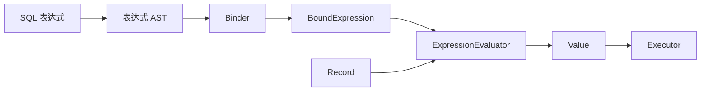
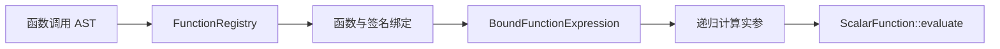

# 表达式求值总览

表达式求值负责把 Binder 已经完成名称解析和类型确定的表达式树应用到一条运行时记录，并产生一个 `Value`。它位于绑定与物理执行之间，是过滤、投影、排序、数据修改和向量检索共同使用的运行时能力。



## 职责边界

一条表达式在执行前依次经过三个阶段：

| 阶段 | 输入 | 主要职责 | 输出 |
| --- | --- | --- | --- |
| Parser | SQL Token | 识别语法结构和操作符优先级 | 表达式 AST |
| Binder | AST、Catalog、函数注册表 | 解析列名、检查类型、选择函数重载、插入转换 | `BoundExpression` |
| Evaluator | `BoundExpression`、`Record` | 读取运行时值并递归计算 | `Value` |

Evaluator 不再查询 Catalog，也不重新决定表达式类型。例如，数值运算的公共类型由 Binder 计算，必要的 `BoundCastExpression` 也由 Binder 插入；Evaluator 只执行已经确定的转换和运算。

完整 SQL 处理过程参见 [绑定器](../../sql_processing_pipeline/binder/README.md)和[执行器](../../sql_processing_pipeline/executor/README.md)。

## 核心对象

### BoundExpression

绑定表达式是运行时求值的输入。每个节点都包含：

- `kind`：表达式节点种类；
- `type`：已经确定的结果逻辑类型；
- `location`：对应的 SQL 源码位置。

表达式节点以独占所有权组成递归树，同时提供 `clone()` 进行深拷贝。当前求值器根据 `BoundExpressionKind` 分派到各类节点的实现。

### Record

`Record` 提供当前行的值。列引用节点已经保存稳定的 `ColumnId`；求值时使用 `column_id - 1` 访问 `RecordData::values`。

因此，当前求值模型是：

```text
一棵绑定表达式树 + 一条 Record -> 一个 Value
```

它不是批量、列式或向量化表达式执行器。

### Value

表达式结果统一使用 `common::Value` 表示。当前可保存：

- `NULL`
- `BOOLEAN`
- `INTEGER`
- `BIGINT`
- `FLOAT`
- `DOUBLE`
- `VARCHAR`
- `VECTOR`

`VECTOR` 的运行时表示为 `std::vector<double>`。

## 支持的表达式节点

当前绑定表达式模型包括：

| 节点 | 示例 | 求值结果 |
| --- | --- | --- |
| Literal | `42`、`'alice'` | 对应类型的常量 |
| Null | `NULL` | 空值 |
| ColumnRef | `users.age` | 当前记录中的列值 |
| Unary | `NOT active`、`-price` | 一元运算结果 |
| Binary | `age + 1`、`age >= 18` | 算术、比较或逻辑结果 |
| Vector | `[1.0, 2.0]` | `VectorValue` |
| Function | `l2_distance(a, b)` | 标量函数结果 |
| In | `age IN (18, 20)` | 布尔值或 `NULL` |
| Between | `age BETWEEN 18 AND 60` | 布尔值或 `NULL` |
| Like | `name LIKE 'a%'` | 布尔值或 `NULL` |
| Cast | 隐式类型提升 | 目标类型的值 |
| Wildcard | `*`、`users.*` | 不可直接求值 |

通配符属于绑定表达式模型，但必须在投影绑定阶段展开为具体列。把 `Wildcard` 直接交给 Evaluator 会得到 `UnsupportedExpression`。

## 执行器中的使用位置

同一个 `ExpressionEvaluator` 被多个物理执行路径复用：

- Scan 或 Filter 的谓词；
- Projection 的结果列；
- Sort 的排序键；
- INSERT 中的常量或计算值；
- UPDATE 的赋值表达式和过滤条件；
- DELETE 的过滤条件；
- 向量检索的查询向量。

谓词与普通值使用不同入口：

- `evaluate()` 返回任意 `Value`；
- `evaluate_predicate()` 要求结果为布尔值，并将 `NULL` 解释为不匹配。

这使 SQL 的过滤语义集中在表达式边界，而不是由各个执行算子分别处理。

## 与函数系统的关系

函数调用横跨 Binder、函数系统和 Evaluator：



Binder 负责函数名查找、重载匹配、参数类型转换和向量维度检查。绑定节点保存选中的 `ScalarFunction` 和 `FunctionSignature`。Evaluator 只计算参数并调用已经绑定的函数。

函数注册、签名和重载规则应放在[函数系统](../../function_system/README.md)中，本章只说明函数表达式如何参与求值。

## 当前边界

- 当前按单条 `Record` 递归求值，不进行批量或向量化执行。
- 当前没有表达式字节码、JIT 或公共子表达式缓存。
- `AND` 和 `OR` 当前会先计算左右两侧，不提供短路求值。
- 聚合函数不由当前 `ExpressionEvaluator` 执行。
- 通配符必须在进入求值器前展开。
- 名称解析、类型推导和函数重载均属于 Binder。

具体运行流程参见[求值器与执行流程](../evaluator/README.md)，各操作符和 `NULL` 的结果规则参见[求值语义](../semantics/README.md)。
