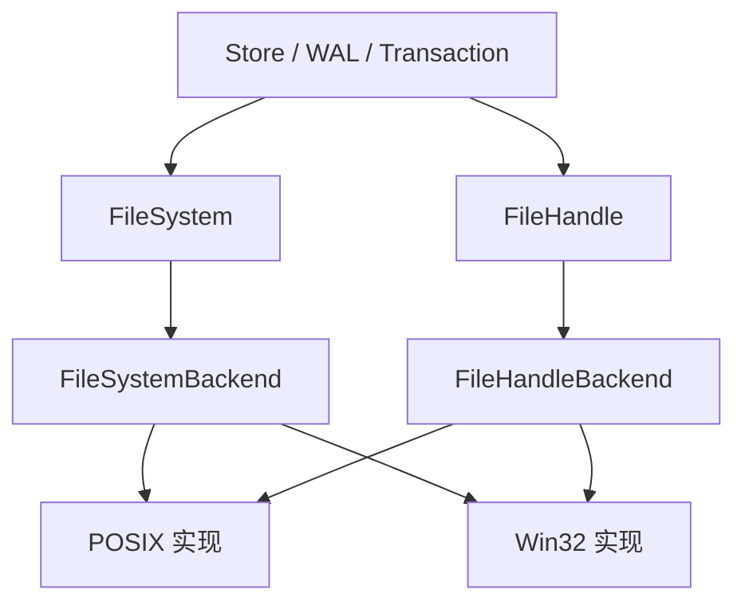
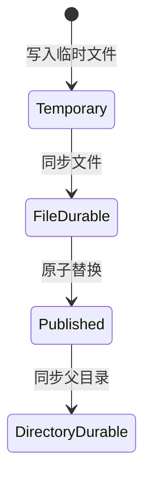

# 文件系统

文件系统模块为 LiteDB 提供稳定的跨平台文件操作语义。上层只依赖 `FileSystem` 和 `FileHandle`，平台差异由 POSIX 与 Win32 后端处理。

## 组件边界

`create_platform_filesystem()` 创建当前平台后端。公共对象只拥有抽象后端，不向上层暴露文件描述符或 Win32 `HANDLE`。`FileSystem` 和 `FileHandle` 都不可复制但可以移动，从而保持底层资源的唯一所有权。

## 文件与目录操作

`FileSystem` 提供以下操作：

| 操作 | 语义 |
| --- | --- |
| `open` | 按访问方式和创建方式打开文件 |
| `list_dir` | 返回目录中的路径列表 |
| `exists` | 判断路径是否存在 |
| `create_dir_all` | 创建目录及缺失的父目录 |
| `rename` | 仅在目标不存在时重命名 |
| `replace_file_atomic` | 原子发布源文件，并允许替换已有目标文件 |
| `remove` | 删除文件或空目录 |
| `sync_directory` | 将目录项变更同步到持久化存储 |

`rename` 和 `replace_file_atomic` 是两个有意分开的接口。普通 `rename` 不覆盖已有目标，可以防止调用方无意替换文件；只有明确执行发布协议时才使用 `replace_file_atomic`。

## 打开选项

`FileOpenOptions` 将访问权限和创建行为正交组合。

访问方式包括：

- `ReadOnly`：只读；
- `WriteOnly`：只写；
- `ReadWrite`：可读写。

创建方式包括：

- `OpenExisting`：文件必须已经存在；
- `OpenOrCreate`：打开已有文件，不存在时创建；
- `CreateNew`：只创建新文件，已存在时报错；
- `TruncateExisting`：打开并清空已有文件；
- `CreateOrTruncate`：创建新文件或清空已有文件。

截断会修改文件，因此 `ReadOnly` 与两种截断模式的组合会在公共层直接返回 `InvalidArgument`，不把明显无效的组合交给平台。

## 文件句柄语义

`FileHandle` 提供基于显式偏移的操作：

| 操作 | 成功保证 |
| --- | --- |
| `read_at(offset, buffer)` | 返回实际读取字节数；文件尾允许短读 |
| `write_at(offset, data)` | 写完整个缓冲区，否则返回错误 |
| `append(data)` | 在该句柄观察到的文件末尾写完整个缓冲区 |
| `size()` | 返回当前文件大小 |
| `truncate(size)` | 将文件调整到指定大小 |
| `sync_data()` | 同步数据及读取数据所需的元数据 |
| `sync_all()` | 同步数据和完整文件元数据 |
| `close()` | 关闭底层资源 |

POSIX 后端使用定位读写，并处理系统调用中断和短写；Win32 后端使用显式文件偏移完成相同语义。公共契约因此不要求调用方处理部分写入。

到达文件尾不是 `read_at` 的错误。调用方如果需要固定长度数据，应在 IO 层使用 `ByteReader::read_exact`，由它把提前结束转换为 `UnexpectedEof`。

## 并发边界

每个后端句柄内部使用互斥保护句柄状态和操作。`append` 在同一个 `FileHandle` 实例内将“确定文件末尾”和“写入数据”串行化，因此多个线程共享同一实例时不会彼此覆盖。

这个保证不扩展到：

- 指向同一文件的两个不同 `FileHandle`；
- 其他进程打开的句柄；
- 多个文件之间的写入。

因此，当前 `append` 不能被描述为跨句柄或跨进程的原子日志追加。WAL 的写入顺序仍必须由其上层所有者协调。

## 同步与可靠发布

“写入成功”“路径已切换”和“掉电后仍然存在”是三个不同状态。可靠替换单个文件时，调用方应执行：

1. 在目标目录中创建临时文件；
2. 写入全部内容；
3. 对临时文件执行 `sync_all` 或满足协议要求的同步；
4. 关闭临时文件；
5. 调用 `replace_file_atomic` 切换目标路径；
6. 对目标文件的父目录执行 `sync_directory`。

`replace_file_atomic` 要求源文件与目标文件位于同一文件系统。它只负责原子替换，不会隐式同步源文件，也不会隐式同步父目录。

POSIX 后端通过目录文件描述符执行 `fsync`。Win32 后端尝试打开目录并调用 `FlushFileBuffers`；如果当前文件系统或平台不支持目录同步，会返回 `Unsupported`。上层必须根据自己的耐久性要求显式处理该能力差异。

## 错误模型

所有操作返回 `std::expected<..., error::Error>`。稳定的 `FileSystemErrorCode` 用于程序判断，包括：

- 路径状态：`NotFound`、`AlreadyExists`、`InvalidPath`；
- 对象类型：`NotAFile`、`NotADirectory`、`DirectoryNotEmpty`；
- 权限与能力：`PermissionDenied`、`ReadOnly`、`Unsupported`；
- 资源状态：`NoSpace`、`ResourceBusy`；
- 调用或系统错误：`InvalidArgument`、`IoError`。

`FileSystemErrorContext` 继续保留：

| 字段 | 内容 |
| --- | --- |
| `operation` | 失败的公共操作或系统调用 |
| `path` | 主要路径 |
| `related_path` | 重命名、替换等操作的第二路径 |
| `native_code` | POSIX 或 Win32 原始错误码 |

上层应使用稳定错误码决定控制流，并把上下文用于诊断。路径作为 `std::filesystem::path` 保留，不在核心层提前转换为展示字符串。

## 平台一致性

两个平台后端共同实现公共契约，但系统调用并非逐项完全对称：

- POSIX 使用文件描述符、定位读写、`fdatasync`、`fsync`；
- Win32 使用 `CreateFileW`、带偏移的文件操作和 `FlushFileBuffers`；
- 两端都检查偏移与长度转换是否溢出；
- 两端都把原生错误映射到稳定的文件系统错误码，并保留原生错误详情。

跨平台一致性指上层可见语义一致，不表示底层调用或持久化能力完全相同。

## 测试重点

文件系统测试分为两层：

- 契约测试验证公共包装的转发、移动语义、无效打开选项和错误传播；
- 平台测试验证真实文件上的访问模式、定位覆盖、短读、截断、追加、同步、重命名、原子替换、目录操作和原生错误上下文。

并发追加测试只验证同一句柄实例的串行化保证。目录同步测试允许平台明确返回 `Unsupported`，但不接受其他未约定错误。

## 当前边界

- 文件系统 API 是同步阻塞式的。
- 同一句柄上的操作被串行化，没有跨句柄协调。
- `replace_file_atomic` 只提供单路径发布原语，不提供多文件事务。
- 文件同步和目录同步必须由上层按协议组合。
- 文件系统层不理解页、记录、Catalog 或 WAL 格式。
