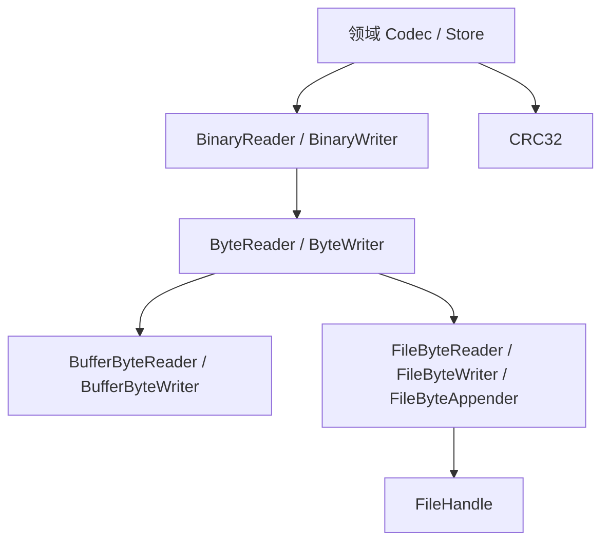

# IO

IO 模块位于文件系统与具体磁盘格式之间。它把“从哪里读写字节”和“如何编码数据”分开，使相同的二进制 Codec 可以作用于内存缓冲区或文件。

## 组件结构



这个分层让格式代码只关心字段顺序、类型和限制，而不需要分别实现内存版与文件版序列化。

## 字节流接口

`ByteReader` 定义两种读取语义：

- `read_some` 尽力读取，允许返回少于请求长度的字节数；
- `read_exact` 循环调用 `read_some`，直到填满缓冲区；如果数据提前结束，返回 `UnexpectedEof`。

短读并不等于文件损坏。文件、管道或自定义 Reader 都可能合法地分段返回数据。只有掌握格式长度的上层才能判断是否必须读满，因此精确读取由 `ByteReader` 在通用层组合，而不是改变底层 `FileHandle::read_at` 的语义。

`ByteWriter` 的 `write_bytes` 则采用全写语义：成功表示整个输入已经交给目标 Writer。对于文件适配器，这一保证最终来自 `FileHandle::write_at` 或 `append`。

## 内存适配器

`BufferByteReader` 借用一段只读字节并维护逻辑偏移；到达末尾时返回零字节。

`BufferByteWriter` 拥有动态字节数组，并在构造时接收最大容量：

- 写入前检查当前大小与新增长度；
- 超过限制时返回 `ValueTooLarge`；
- `bytes()` 提供只读访问；
- `take_bytes()` 转移缓冲区所有权。

容量检查在扩容前执行，因此可用于安全编码即将写入磁盘的数据。

## 文件适配器

文件适配器借用 `FileHandle`，不拥有也不延长句柄生命周期：

| 适配器 | 行为 |
| --- | --- |
| `FileByteReader` | 从逻辑偏移读取，并按实际读取长度推进偏移 |
| `FileByteWriter` | 从指定初始偏移写入，成功后推进偏移 |
| `FileByteAppender` | 每次通过文件句柄的追加语义写入 |

读取或写入失败时，逻辑偏移不会被错误地推进。适配器直接传播底层 `error::Error`，所以 `NoSpace`、关闭句柄或权限错误仍保持文件系统错误码及 `FileSystemErrorContext`，不会被改写成丢失路径信息的普通 IO 错误。

`FileByteReader` 和 `FileByteWriter` 的逻辑偏移面向单消费者，不保证多个线程共享同一个适配器时的并发安全。

## 二进制编码

`BinaryWriter` 提供稳定的**小端**编码：

- 无符号整数：`u8`、`u16`、`u32`、`u64`；
- 有符号整数：`i32`、`i64`；
- IEEE 754 浮点数：`f32`、`f64`；
- 长度前缀字符串：`u32` 字节长度加原始字符串字节。

多字节数值逐字节编码为小端序，不依赖主机端序或 C++ 对象内存布局。有符号整数和浮点数通过保持位模式的转换处理。字符串长度表示 UTF-8 或其他字节内容的长度，IO 层本身不解释字符编码。

`BinaryReader` 执行对称解码，并通过 `ByteReader::read_exact` 拒绝截断的定长字段。

写入字符串 `"hello"` 后的内存布局示例：

```text
write_string("hello")

+----------------------+-------------------------+
| u32 little-endian: 5 | 68 65 6c 6c 6f          |
+----------------------+-------------------------+
| 4 bytes              | 5 bytes                 |
+----------------------+-------------------------+
```

## 解码资源限制

`BinaryDecodeLimits` 包含两个独立限制：

| 限制 | 作用 |
| --- | --- |
| `max_total_bytes` | 限制该 Reader 最多消费的总字节数 |
| `max_string_bytes` | 限制单个字符串声明的长度 |

读取每个字段前先检查剩余预算。读取字符串时，先读取长度，再检查单字符串上限和总预算，最后才分配内存。这可以阻止损坏文件声明超大字符串并直接触发巨额分配。

这些限制只是通用解码底线。具体格式仍需增加自己的文件总大小、对象数量、页大小、递归深度和引用合法性检查。

## 校验和

`crc32` 实现 IEEE CRC32，可对任意字节范围计算校验值。当前 Meta、Storage 和 B+Tree 等持久化组件使用它检测头部、Payload 或页面损坏。

CRC32 用于发现意外损坏，不提供身份认证，也不能防止恶意篡改。校验范围、校验字段置零规则以及校验失败对应的领域错误，仍由具体文件格式定义。

## 错误模型

IO 自身定义三个稳定错误码：

| 错误码 | 含义 |
| --- | --- |
| `UnexpectedEof` | 固定长度数据提前结束或超出剩余预算 |
| `InvalidData` | Reader 违反接口契约或数据结构无效 |
| `ValueTooLarge` | 编码值、缓冲区或声明长度超过限制 |

`IoError` 与文件系统错误都使用统一的 `error::Error` 表示，因此一个声明为 `std::expected<..., IoError>` 的操作仍能无损传播底层文件系统类别、错误码和类型化上下文。调用方不能假设文件适配器失败时一定属于 IO 类别。

核心实现通过返回值传播错误，不依赖异常。

## 典型使用方式

编码一个有大小上限的对象时：

1. 创建 `BufferByteWriter(max_bytes)`；
2. 在其上创建 `BinaryWriter`；
3. 按格式顺序写入字段；
4. 对编码结果计算 CRC32；
5. 使用 `FileByteWriter` 写入文件；
6. 由上层持久化协议决定是否同步和发布文件。

加载时则反向执行：

1. 先由文件格式验证文件头和声明长度；
2. 将受控范围交给 `BufferByteReader` 或 `FileByteReader`；
3. 使用带预算的 `BinaryReader` 解码；
4. 验证 CRC32、版本、保留字段和对象关系；
5. 只有所有校验成功后才构建在线对象。

## 测试重点

IO 测试覆盖：

- 整数与浮点数的精确小端字节布局；
- 内存写入容量限制；
- 分块短读条件下的精确读取；
- 截断数据返回 `UnexpectedEof`；
- 超大字符串在分配前被拒绝；
- 文件适配器的偏移推进与失败不推进；
- 文件系统错误码和类型化上下文穿过 IO 适配器后仍然保留。

上层格式测试还应覆盖 CRC 损坏、Magic、版本、长度不一致和尾部多余数据。

## 当前边界

- IO 层只提供同步字节流，不提供异步或缓冲调度。
- `BinaryWriter` 不自动添加文件头、版本或校验和。
- `BinaryReader` 不验证领域对象关系。
- CRC32 只检测损坏，不提供安全认证。
- 刷盘、原子替换、事务提交和恢复均由上层负责。
