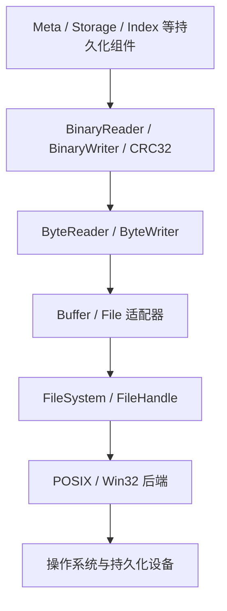

# 文件系统与 IO

文件系统与 IO 位于 LiteDB 持久化栈的底部。它们共同屏蔽平台差异并提供可复用的二进制读写能力，但承担不同职责：

- [文件系统](../filesystem/README.md)负责文件、目录和文件句柄操作，定义打开、定位读写、追加、同步、重命名和原子替换等跨平台语义；
- [IO](../io/README.md)建立在文件系统或内存缓冲区之上，负责字节流适配、精确读取、小端二进制编码、解码资源限制和 CRC32 校验。

这两个模块提供的是基础机制，不定义具体存储格式，也不承担事务协调：

- Magic、版本、页布局和记录格式由各领域 Store 或 Codec 定义；
- 单文件可靠发布由调用方组合写入、同步、原子替换和目录同步；
- 多文件原子性由 `TransactionManager + WAL` 提供；
- 页缓存、淘汰、脏页跟踪和锁管理不属于当前文件系统或 IO 层。

## 设计原则

### 明确区分机制与策略

`FileHandle::write_at` 保证成功时写完整个缓冲区，但它不会自动同步文件；`replace_file_atomic` 保证目标路径的原子切换，但它不会代替源文件同步和父目录同步。是否需要持久化、何时同步、多个文件如何一起提交，由上层协议决定。

### 使用显式结果传播错误

核心路径通过 `std::expected` 返回结果，不依赖异常。文件系统错误保留操作名、路径、关联路径和平台错误码；IO 自身只增加截断、非法数据和资源超限等数据层错误。文件适配器不会把底层文件系统错误压缩成笼统的 IO 错误。

### 对不可信磁盘数据设置边界

磁盘文件中的长度和数量不能直接决定内存分配。`BinaryReader` 同时约束总读取字节数和单字符串长度，上层格式还应继续约束文件大小、对象数量和递归深度。

## 与上层模块的关系

元数据存储、数据库清单和记录编码直接复用 `BinaryReader`、`BinaryWriter`；Meta、Storage 和 B+Tree 页面使用共享 CRC32 检测损坏。WAL 和部分专用索引格式目前仍保留自己的 Codec 或校验实现，因此 IO 层是通用基础设施，而不是所有磁盘格式的统一实现。

单文件发布的典型顺序为：

其中任何一步都不能推导出跨文件事务已经提交。需要同时更新 Catalog、集合和索引时，应使用 [事务与恢复](../../transaction_and_recovery/README.md) 描述的暂存、WAL 和恢复协议。

## 当前边界

- 当前提供 Win32 和 POSIX 两套文件系统后端。
- 当前 IO 是同步、阻塞式抽象，不提供异步 IO。
- 当前没有通用 Buffer Pool 或 PageFile 抽象。
- 文件系统层不解析 LiteDB 文件格式。
- IO 层不决定刷盘、提交或恢复时机。
