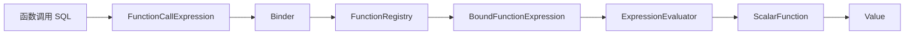
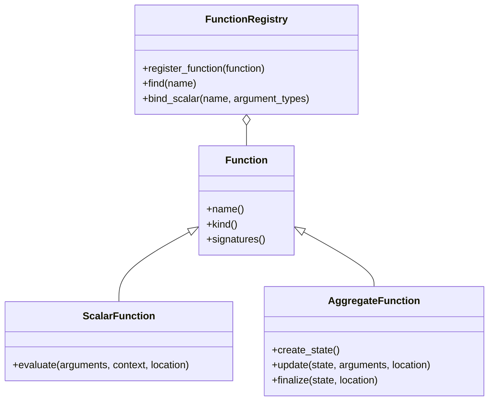

# 函数系统总览

函数系统负责描述函数身份与签名、注册内置函数、为调用选择匹配实现，并在表达式求值阶段执行函数。当前真正形成完整链路的是标量函数；聚合函数只有抽象接口，尚未接入 Binder、计划器和执行器。



## 职责边界

函数调用依次经过：

| 阶段 | 主要职责 |
| --- | --- |
| Parser | 解析函数名和参数表达式 |
| FunctionRegistry | 按名称查找函数并匹配签名 |
| Binder | 绑定参数、选择标量函数、检查类型和向量维度、插入转换 |
| BoundFunctionExpression | 保存函数对象、签名、参数、返回类型和源码位置 |
| ExpressionEvaluator | 从左到右计算参数并调用已绑定函数 |
| ScalarFunction | 执行具体函数逻辑并返回 `Value` 或 `FunctionError` |

函数系统不解析 SQL，不查询 Catalog，也不决定函数调用位于投影、排序还是过滤条件中。完整表达式执行过程参见[表达式求值](../../expression_evaluation/overview/README.md)。

## 核心组成



`Function` 提供名称、种类和签名集合。`ScalarFunction` 保存执行函数指针；`FunctionRegistry` 保存函数对象并为标量调用选择签名。

## 当前能力

| 能力 | 状态 |
| --- | --- |
| 标量函数模型 | 已实现 |
| 函数签名 | 已实现 |
| 同一函数的多签名 | 已支持顺序匹配 |
| 可变参数签名 | 字段和匹配逻辑已存在，暂无内置函数使用 |
| 内置函数注册表 | 已实现 |
| SQL 函数绑定 | 已实现 |
| 标量函数逐行求值 | 已实现 |
| 用户自定义函数 | 未实现 |
| 会话或数据库级函数 | 未实现 |
| 聚合函数 | 只有抽象接口 |
| 窗口函数 | 未实现 |
| 表函数 | 未实现 |

## 当前内置函数

当前只注册三个向量标量函数：

```text
l2_distance(VECTOR, VECTOR) -> DOUBLE
cosine_distance(VECTOR, VECTOR) -> DOUBLE
inner_product(VECTOR, VECTOR) -> DOUBLE
```

三个函数都可以作为普通表达式参与投影、过滤或排序。优化器还会识别特定函数和排序方向，尝试将 `ORDER BY ... LIMIT ...` 改写为向量索引搜索。

具体语义参见[内置向量函数](../vector_functions/README.md)。

## 内置注册表

内置注册过程为：

```text
make_builtin_function_registry()
    -> register_builtin_functions()
        -> register_vector_functions()
```

`builtin_function_registry()` 持有进程内共享的静态注册表。Binder 通过只读引用使用它；绑定后的表达式节点持有具体标量函数的共享只读指针，后续求值不再查询注册表。

## 标量函数执行

函数绑定完成后，Evaluator 按以下顺序执行：

1. 从左到右递归计算每个参数表达式；
2. 将参数结果收集为 `std::vector<Value>`；
3. 创建 `ScalarFunctionContext`；
4. 调用 `ScalarFunction::evaluate`；
5. 返回函数值，或把 `FunctionError` 转换为求值错误。

当前 `ScalarFunctionContext` 是空结构，尚未承载会话、事务、时间、区域设置或 Catalog 等状态。因此当前函数都是只依赖显式参数的纯计算形式，但系统尚未用元数据正式声明确定性、易变性或副作用属性。

## 聚合函数现状

`AggregateFunction` 已定义：

- `AggregateState`
- `create_state`
- `update`
- `finalize`

但当前没有：

- 具体聚合函数；
- 聚合函数注册和 `bind_aggregate`；
- 聚合表达式节点；
- GROUP BY 或聚合物理算子；
- 聚合状态生命周期管理；
- Executor 接入和聚合测试。

因此，聚合函数应视为未来扩展接口，而不是当前已支持能力。现阶段不为它单独建立功能章节。

## 当前边界

- 注册表只支持按名称保存函数，没有命名空间或 Schema。
- 标量签名按声明顺序匹配，不计算最佳重载。
- 没有重载歧义诊断。
- 没有 UDF、插件函数或动态注册接口。
- 没有函数权限、确定性、NULL 策略或代价元数据。
- 聚合函数没有完整执行链路。
- 当前只有向量类内置函数。

函数对象、注册和签名匹配的细节参见[函数模型、注册与绑定](../registry_and_binding/README.md)。
