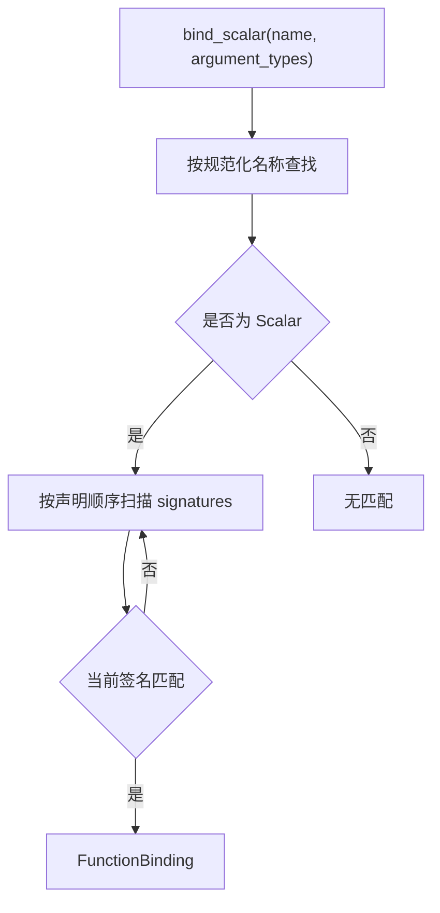
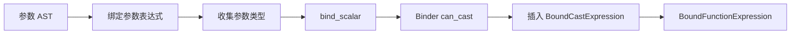

# 函数模型、注册与绑定

函数模型将函数身份、可调用签名和具体执行逻辑分开。注册表管理函数对象；Binder 根据实参类型选择签名，并把结果固化到 `BoundFunctionExpression` 中。

## Function

`Function` 是所有函数的公共基类，保存：

- 函数名称；
- `FunctionKind`；
- 函数签名集合。

当前函数种类包括：

```text
Scalar
Aggregate
```

函数对象不可复制但可以移动。实际注册时使用 `shared_ptr<Function>` 管理生命周期；绑定完成后转换为共享只读指针交给表达式树。

## FunctionSignature

每个签名包含：

| 字段 | 作用 |
| --- | --- |
| `name` | 签名对应的函数名 |
| `argument_types` | 形参逻辑类型列表 |
| `return_type` | 返回逻辑类型 |
| `variadic` | 是否允许可变数量参数 |

例如当前向量距离签名为：

```text
name: l2_distance
arguments: [VECTOR, VECTOR]
return: DOUBLE
variadic: false
```

签名中的 VECTOR 没有维度参数，因此可以接受任意静态维度。两个实参维度必须一致的规则目前由 Binder 针对三个向量函数额外检查，函数实现也会在运行时再次检查。

## ScalarFunction

`ScalarFunction` 保存：

- 一个或多个 `FunctionSignature`；
- 一个 `EvalFn` 函数指针。

执行函数签名为：

```cpp
expected<Value, FunctionError> (
    const vector<Value>& arguments,
    const ScalarFunctionContext& context,
    AstNodeLocation location
)
```

函数实现负责检查运行时参数数量、值类型和值约束，并返回结果或函数错误。`ScalarFunction` 本身只转发调用，不执行通用的参数验证或 NULL 传播。

同一名称的重载应放在同一个 `ScalarFunction` 的签名列表中，共享同一个执行入口；执行函数可以根据参数运行时类型处理不同签名。

## 名称规范化

注册、查找和绑定都会调用 `normalize_function_name`，把函数名转换为小写。因此函数名匹配不区分 ASCII 大小写：

```sql
l2_distance(...)
L2_DISTANCE(...)
L2_Distance(...)
```

这些写法会查找同一个注册项。当前实现使用逐字符 `tolower`，不应把它描述为完整的 Unicode 名称规范化。

## 注册表

`FunctionRegistry` 内部按规范化名称保存：

```text
unordered_map<string, shared_ptr<Function>>
```

公共操作包括：

| 操作 | 行为 |
| --- | --- |
| `register_function` | 注册函数对象 |
| `find` | 按名称查找任意种类函数 |
| `bind_scalar` | 查找标量函数并匹配参数签名 |

再次注册相同规范化名称会替换旧函数对象，不会自动合并两个对象的签名。因此，注册重载时不能多次注册同名 `ScalarFunction` 并期待签名累积。

## 签名匹配

`bind_scalar` 的执行顺序为：

1. 规范化函数名；
2. 查找注册对象；
3. 检查函数种类是 `Scalar`；
4. 按声明顺序扫描签名；
5. 返回第一个匹配的签名；
6. 没有匹配项时返回空。



当前不是基于转换代价的最佳重载选择：

- 不计算精确匹配优先级；
- 不比较转换次数；
- 不选择最具体签名；
- 不检测两个签名同时匹配的歧义；
- 签名声明顺序会影响结果。

## 参数数量

非可变参数签名要求形参与实参数量完全相同。

可变参数签名要求实参数量不少于签名参数数量。超出固定列表的参数复用最后一个形参类型。当前没有内置可变参数函数，这部分能力只存在于通用匹配代码中。

后续引入可变参数函数时，应为“空形参列表的 variadic 签名”补充明确约束和测试，避免无法确定重复参数类型。

## 注册表的类型兼容

注册表认为以下类型可以匹配：

- `NULL` 到任意目标类型；
- 完全相同的逻辑类型；
- 任意数值类型之间；
- 兼容的 VECTOR 类型。

VECTOR 匹配规则为：

- 任一侧没有维度参数时可以匹配；
- 两侧都有维度时必须相等。

注册表不负责创建转换节点，只判断签名是否可能适用。

## Binder 二次检查

函数注册表返回签名后，Binder 会再次检查参数并插入必要转换：



这里存在一个当前实现差异：

- 注册表允许数值类型之间双向匹配；
- Binder 的通用 `can_cast` 只允许 `INTEGER -> BIGINT -> FLOAT -> DOUBLE` 方向的提升；
- 注册表选中的签名如果要求缩窄转换，Binder 最终仍会拒绝。

因此，“注册表找到匹配”不等于函数调用一定绑定成功。后续扩展数值重载时，应统一两处转换规则，并引入明确的转换代价与歧义处理。

## 向量维度检查

Binder 目前通过函数名专门识别：

```text
l2_distance
cosine_distance
inner_product
```

当两个参数都是带已知维度的 VECTOR 时，维度不同会在绑定阶段返回类型错误。

这项规则尚未成为签名系统的通用约束。未来如果增加更多向量函数，更适合将“参数维度相同”建模为函数签名或绑定回调的一部分，而不是继续扩展函数名判断。

## BoundFunctionExpression

绑定成功后，函数调用节点保存：

| 数据 | 用途 |
| --- | --- |
| 函数名 | 调试、计划检查和优化器识别 |
| `shared_ptr<const ScalarFunction>` | 保持函数实现生命周期 |
| 已选签名 | 固化参数和返回类型 |
| 参数表达式 | 运行时递归求值 |
| 结果类型 | 供后续计划和表达式使用 |
| AST 位置 | 错误定位 |

Evaluator 因此不需要重复执行名称查找或重载解析。

## 函数错误

当前函数错误码为：

| 错误码 | 典型原因 |
| --- | --- |
| `InvalidArgument` | 参数数量错误、向量维度不一致 |
| `InvalidType` | 运行时值不是签名要求的类型 |

`FunctionErrorContext` 保存 SQL 节点位置。

Evaluator 转换函数错误时：

- `InvalidType` 转换为求值层的 `InvalidType`；
- 其他函数错误目前转换为 `UnsupportedExpression`；
- 原始 `FunctionError` 作为底层错误保留。

当前映射不能精确表示所有 `InvalidArgument` 情况，后续可以增加对应的求值错误码或让上层保留函数类别进行展示。

## 当前边界

- 同名注册是替换，不是重载合并。
- 重载选择是第一个匹配，不是最佳匹配。
- 注册表和 Binder 的数值转换规则尚未统一。
- 向量维度关系通过函数名特判。
- `ScalarFunctionContext` 当前为空。
- 没有函数别名、命名空间、权限或版本。
- 没有直接的聚合函数绑定接口。
