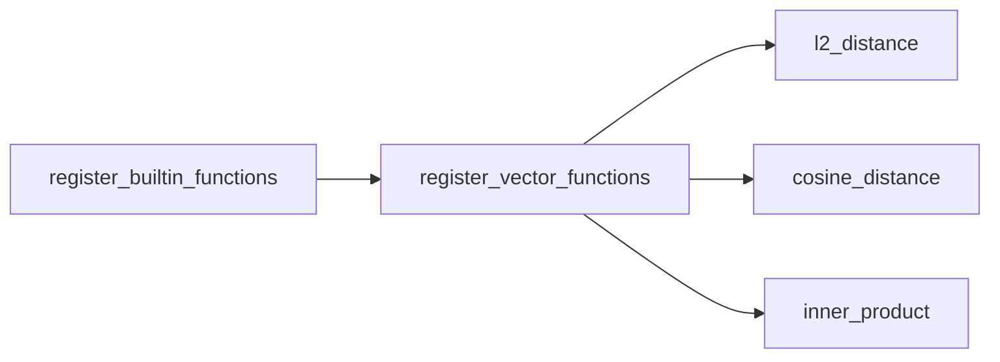

# 内置向量函数

当前内置函数全部是二元向量标量函数。它们接受两个 VECTOR，逐行计算并返回 DOUBLE：

```text
l2_distance(VECTOR, VECTOR) -> DOUBLE
cosine_distance(VECTOR, VECTOR) -> DOUBLE
inner_product(VECTOR, VECTOR) -> DOUBLE
```

## 注册方式

`register_builtin_functions` 当前只调用 `register_vector_functions`。三个函数各自注册为一个 `ScalarFunction`，每个函数包含一个通用 VECTOR 签名和一个执行 Lambda。



## 共同参数语义

三个函数共享同一个运行时包装逻辑：

1. 参数数量必须为 2；
2. 任一参数为 `NULL` 时返回 `NULL`；
3. 两个运行时值都必须是 `VectorValue`；
4. 两个向量的元素数量必须相同；
5. 调用具体计算函数；
6. 将 `double` 结果包装为 `Value`。

| 情况 | 结果 |
| --- | --- |
| 两个合法同维向量 | `DOUBLE` |
| 任一参数为 `NULL` | `NULL` |
| 参数数量不是 2 | `InvalidArgument` |
| 参数不是 VECTOR | `InvalidType` |
| 运行时维度不同 | `InvalidArgument` |

Binder 会在两个向量静态维度都已知时提前拒绝维度不一致；函数实现仍保留运行时检查，避免内部调用或异常记录绕过静态约束。

## L2 距离

`l2_distance` 计算欧氏距离：

```text
                  n
distance = sqrt( sum((left[i] - right[i])²) )
                 i=1
```

示例：

```sql
SELECT id,
       l2_distance(embedding, [0.1, 0.2, 0.3]) AS distance
FROM documents
ORDER BY distance ASC
LIMIT 10;
```

距离越小表示两个向量越接近。优化器只在升序排序时考虑使用 L2 向量索引：

```text
ORDER BY l2_distance(indexed_vector, query_vector) ASC
```

## 余弦距离

`cosine_distance` 计算：

```text
                     dot(left, right)
distance = 1 - ------------------------------
               norm(left) * norm(right)
```

当前任一向量范数为零时直接返回 `1.0`，而不是产生除零错误或 `NULL`。

示例：

```sql
SELECT id
FROM documents
ORDER BY cosine_distance(embedding, [1.0, 0.0, 0.0]) ASC
LIMIT 10;
```

距离越小通常表示方向越接近。优化器在升序排序时考虑使用 Cosine 向量索引。

## 内积

`inner_product` 计算原始点积：

```text
              n
result =     sum(left[i] * right[i])
             i=1
```

示例：

```sql
SELECT id
FROM documents
ORDER BY inner_product(embedding, [1.0, 0.0, 0.0]) DESC
LIMIT 10;
```

内积越大通常表示越相似，因此 SQL 查询使用降序。优化器只在降序排序时考虑使用 Inner Product 向量索引。

## 与向量索引距离的区别

SQL 标量函数和向量索引模块目前分别实现距离计算：

| 场景 | Inner Product 表示 |
| --- | --- |
| SQL `inner_product` | 返回原始内积，越大越靠前 |
| 索引距离 | 使用负内积，使更相似的结果具有更小距离 |

因此：

```text
SQL 排序：ORDER BY inner_product(...) DESC
索引搜索：最小化 negative_inner_product(...)
```

两条路径的排序含义一致，但不能把 SQL 函数描述为直接调用索引模块的距离实现。

## 优化器识别

优化器目前按函数名、排序方向和索引度量识别向量搜索：

| 函数 | 必需排序方向 | 对应索引度量 |
| --- | --- | --- |
| `l2_distance` | ASC | L2 |
| `cosine_distance` | ASC | Cosine |
| `inner_product` | DESC | Inner Product |

此外还需要满足向量索引存在、被索引列位置正确、查询向量可独立求值、LIMIT 等计划条件。函数调用本身不保证一定产生向量索引计划。

无法使用索引时，Executor 仍可对每条记录计算函数结果，再使用普通排序完成查询。

## 函数参数与查询向量

常见调用形式是：

```text
distance(indexed_column, query_vector)
```

优化器对可转换为索引搜索的表达式形态有额外约束。例如，查询向量需要能够在没有当前记录的情况下求值，不能依赖另一列。

普通表达式求值则没有这一索引规划限制。只要 Binder 接受，函数可以在投影或普通逐行排序中计算两个运行时向量。

## NULL 行为

三个函数都采用相同 NULL 传播：

```text
function(NULL, vector) -> NULL
function(vector, NULL) -> NULL
```

Evaluator 不统一实现这项规则，而是由向量函数公共包装逻辑处理。未来新增函数时，需要自行定义和实现 NULL 策略。

## 数值边界

当前 SQL 向量函数直接使用 `double` 执行减法、乘法、累加、平方根和除法，没有额外检查：

- 输入元素是否有限；
- 中间结果是否溢出为无穷；
- 最终结果是否为 NaN；
- 浮点累加误差。

向量索引模块拥有自己的距离错误和数值检查路径，不能据此推导 SQL 标量函数也具备相同保护。

如果需要统一语义，应抽取共享且带错误返回的距离原语，并同时验证 SQL 逐行求值和索引搜索的结果约定。

## 当前边界

- 只有三个二元向量函数。
- 没有向量归一化、维度、范数或元素访问函数。
- 没有统一函数级 NULL 元数据。
- 没有非有限值和数值溢出错误。
- 余弦距离对零向量固定返回 `1.0`。
- SQL 函数与索引距离仍是两套实现。
- 向量索引改写依赖优化器对函数名的显式识别。
