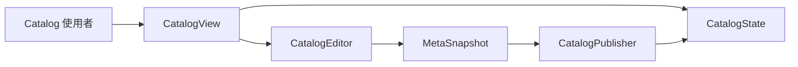
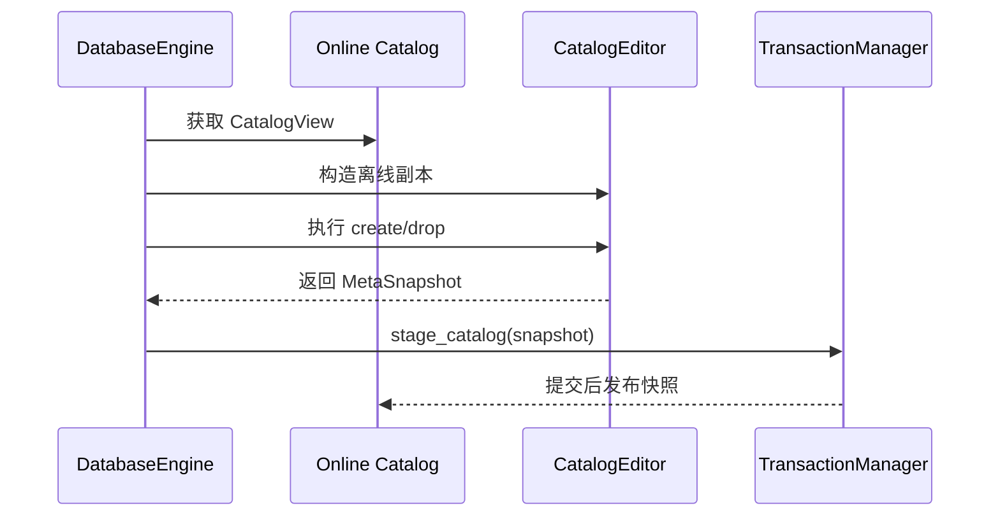

# 元数据引擎

元数据引擎负责 Catalog 的内存表示、查询、结构规则、离线编辑和在线发布。它不负责决定事务何时提交，也不负责实现 `meta.lmeta` 的二进制格式。

## 组件划分

| 组件 | 职责 |
| --- | --- |
| `CatalogState` | 拥有 Entry、维护名称和 ID 索引、执行结构修改 |
| `CatalogView` | 向普通调用者暴露只读查询能力 |
| `CatalogEditor` | 在独立 Catalog 副本上执行 DDL |
| `MetaSnapshot` | 表示可复制、暂存和持久化的完整 Catalog |
| `CatalogPublisher` | 持有在线状态并发布已经提交的快照 |

这种划分将“能够查询”“能够编辑”和“能够发布”表示为不同能力，避免普通读路径绕过事务直接修改在线 Catalog。

## CatalogState

`CatalogState` 是在线或离线 Catalog 的内存表示。它统一拥有数据库、集合、列、标量索引和向量索引 Entry，并维护：

- 按 ID 查找对象的映射；
- 数据库名到数据库 ID 的映射；
- 父对象中的子对象名称映射；
- 对象的显式枚举顺序；
- 各类对象的下一可用 ID。

Catalog 使用内部 ID 建立对象关系，而不是依赖用户可见名称。名称用于 SQL 查找和重复检查，ID 用于跨组件、快照及持久化文件关联。

### ID、名称与顺序

每类对象具有独立的单调递增 ID 空间：

- `DatabaseId`
- `CollectionId`
- `ColumnId`
- `IndexId`
- `VIndexId`

Catalog 同时维护三类信息：

| 信息 | 用途 |
| --- | --- |
| 稳定 ID | 表示对象身份和对象间引用 |
| 规范化名称键 | 执行 SQL 名称查找和重复检查 |
| 有序 ID 列表 | 保留数据库、集合和列的枚举顺序 |

不能使用哈希容器的迭代顺序代替显式顺序，尤其是列顺序会参与记录布局。

## Entry 模型

### DatabaseEntry

数据库是集合的命名空间。数据库条目保存数据库 ID、名称、所属集合的有序 ID 列表，以及规范化集合名到集合 ID 的查找映射。

### CollectionEntry

集合条目保存：

- 集合 ID、所属数据库 ID、名称和可选注释；
- 列、标量索引和向量索引的有序 ID 列表；
- 名称到对象 ID 的查找映射。

集合条目保存关联关系，具体子对象仍由 `CatalogState` 统一拥有。

### ColumnEntry

列条目保存列 ID、所属集合、列序、名称、逻辑类型、可空性、唯一性声明、默认值表达式和注释。

列序定义记录值与列之间的对应关系。Schema Loader 会将集合和列 Entry 投影为 `CollectionSchema`，供存储引擎校验和编解码记录。

### IndexEntry

标量索引条目保存：

- 索引 ID、名称和所属集合；
- 一个或多个有序目标列 ID；
- 索引类型，当前为 B+Tree；
- 是否声明为唯一索引。

目标使用列 ID 表示，使索引身份和引用不依赖列名。接口可以表达复合索引的有序列列表，但具体 SQL 和运行时支持范围参见 [标量索引](../../scalar_index/README.md)。

### VectorIndexEntry

向量索引条目保存：

- 索引 ID、名称、所属集合和目标列 ID；
- 索引类型，当前为 HNSW；
- L2、内积或余弦距离度量；
- 向量维度；
- `max_neighbors`、`ef_construction`、默认 `ef_search` 和随机种子。

这些参数描述检索结构，不属于向量列的 Schema。

## CatalogView

`CatalogView` 是对 `CatalogState` 的非拥有只读视图，提供：

- 按名称或 ID 查找数据库、集合、列及索引；
- 枚举数据库中的集合；
- 枚举集合中的列、标量索引和向量索引；
- 导出完整 `MetaSnapshot`。

Binder、优化器、Schema Loader、存储引擎和索引引擎都通过只读视图访问 Catalog。同一查询接口既可以指向在线 Catalog，也可以指向离线编辑中的 Catalog。

### Entry 指针生命周期

查询接口返回的 Entry 指针借用自底层 `CatalogState`，只在该 Catalog 下一次编辑或发布前有效。

调用者不能跨更新边界长期缓存 Entry 指针。需要稳定保存集合布局时，应复制所需值或构造按值持有的 `CollectionSchema`。

## CatalogEditor

DDL 不在在线 `CatalogState` 上原地执行。系统从当前 `CatalogView` 或 `MetaSnapshot` 构造独立的 `CatalogEditor`，在离线副本上执行创建和删除。

离线编辑需要维护以下不变量：

- 同一命名空间内的名称不能冲突；
- 父对象和被引用对象必须存在；
- 索引目标列必须属于目标集合；
- 向量索引只能引用有效的向量列；
- 删除数据库或集合时级联清理子级元数据；
- ID 分配器和所有正向、反向查找结构同步更新。

编辑失败时，离线副本可以直接丢弃，在线 Catalog 不受影响。

## MetaSnapshot

`MetaSnapshot` 是完整 Catalog 的值表示，包含：

- 各类对象的下一可用 ID；
- 数据库及其集合；
- 集合中的列、标量索引和向量索引；
- 默认值、注释和索引参数。

快照用于：

1. 从在线 Catalog 派生离线编辑器；
2. 在 DDL 事务中传递变更后的 Catalog；
3. 在元数据引擎与 `MetaStore` 之间传递持久化值。

快照适合复制、事务暂存和序列化，但不适合作为高频查询结构。运行时查询仍由 `CatalogState` 的名称和 ID 索引提供。

从快照构建状态时必须重新验证 ID、名称、父子关系、索引引用、列顺序、类型参数和下一 ID 计数器，不能信任磁盘输入。

## CatalogPublisher

`CatalogPublisher` 是在线 Catalog 的唯一拥有者和发布者。数据库打开时，它从 `MetaStore` 加载快照，并构造经过验证的 `CatalogState`。

运行期间，`publish_committed` 只接收已经完成事务提交的快照。它先构造完整的新状态，成功后再整体替换在线状态，避免读者观察到部分 Catalog 更新。

这里的发布是内存可见性边界，不是持久化提交边界。调用者不能通过 `publish_committed` 跳过 `TransactionManager` 发布尚未提交的 DDL。

## Catalog 使用者

| 使用者 | 使用方式 |
| --- | --- |
| Binder | 解析数据库、集合和列名，检查对象与类型 |
| Optimizer | 枚举可用的标量索引和向量索引 |
| Schema Loader | 构造 `CollectionSchema` |
| StorageEngine | 根据 Schema 打开集合 |
| IndexEngine | 根据索引条目创建或恢复 B+Tree |
| VectorIndexEngine | 根据向量索引条目恢复 HNSW |
| TransactionManager | 暂存快照并在提交后发布 |

Catalog 是共享的结构事实来源，但不转发各个引擎的领域操作。

## 设计评价

当前 `CatalogState / CatalogView / CatalogEditor / CatalogPublisher / MetaSnapshot` 的拆分是合理的，建议保留：

- 在线 Catalog 对普通消费者只读；
- DDL 在离线副本上准备；
- 只有已提交快照可以发布；
- 快照传输模型与高效查询模型相互分离。

不建议重新合并成一个能够直接修改在线状态、保存文件并控制事务的大型 `MetaEngine`。那会混淆编辑成功、事务提交和在线发布三种不同状态。

只有出现跨发布边界持有长期读视图的实际需求时，才有必要考虑不可变共享状态或带版本的快照读。当前语句级、单写者模型不需要提前引入 Catalog 锁管理器。

## 当前边界

- Catalog 修改仅通过离线编辑和事务发布生效。
- Entry 指针不能跨编辑或发布长期持有。
- Catalog 使用完整快照，不提供增量变更流。
- 当前没有显式多语句 Catalog 事务。
- Catalog 只管理结构事实，不承担存储和索引引擎的领域操作。
