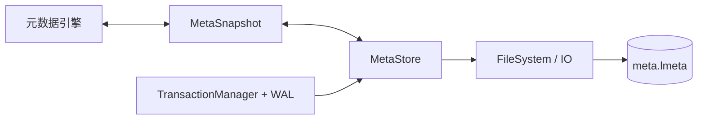

# 元数据存储

元数据存储负责在完整 `MetaSnapshot` 和磁盘文件 `meta.lmeta` 之间转换。它关注文件格式、损坏检测、资源限制和单文件可靠保存，不负责 Catalog 业务规则或跨文件事务。

## 组件边界



`MetaStore` 只提供两类核心操作：

- `load`：读取并解码完整元数据快照；
- `save`：编码并可靠替换完整元数据文件。

它不维护名称索引、不执行 DDL，也不判断一个 Catalog 快照是否应该成为在线状态。

## 文件布局

数据库目录中的元数据文件为：

```text
<data-directory>/
└── meta.lmeta
```

当前文件由固定长度头部和变长 Payload 组成：

```text
+------------------+----------------+
| 固定长度 Header  | 可变长度 Payload |
+------------------+----------------+
| Magic            |                |
| Format Version   | MetaSnapshot   |
| Header Size      | 编码内容        |
| Payload Size     |                |
| Payload CRC32    |                |
| Flags            |                |
+------------------+----------------+
```

头部字段的作用如下：

| 字段 | 作用 |
| --- | --- |
| Magic | 识别 LiteDB 元数据文件 |
| Format Version | 判断磁盘格式是否受当前版本支持 |
| Header Size | 校验头部布局 |
| Payload Size | 校验文件长度和读取边界 |
| Payload CRC32 | 检测 Payload 损坏 |
| Flags | 为格式扩展预留，目前必须为零 |

Payload 编码完整 `MetaSnapshot`，包括下一 ID 计数器、数据库、集合、列及两类索引定义。

## 快照编码

保存元数据时，`MetaStore` 先将 `MetaSnapshot` 编码到有容量上限的内存缓冲区，再计算 Payload CRC32，最后写入文件头和 Payload。

完整快照编码具有以下特点：

- 磁盘内容不依赖内存对象地址；
- 父子对象关系通过稳定 ID 表示；
- 列、索引和数据库的显式顺序得到保留；
- 默认值表达式和向量索引参数可以随 Catalog 持久化；
- 文件格式版本与当前 C++ 对象布局解耦。

不能直接序列化 `CatalogState` 中的哈希表、指针或平台相关对象。

## 加载与校验

`MetaStore::load` 按以下顺序处理元数据文件：

1. 判断文件是否存在；
2. 检查文件至少包含完整头部；
3. 检查总文件大小是否超过预算；
4. 读取并解析固定头部；
5. 验证 Magic、格式版本、头部长度和标志位；
6. 验证 Payload 长度与实际文件长度一致；
7. 计算并验证 Payload CRC32；
8. 在资源预算约束下解码 `MetaSnapshot`；
9. 由元数据引擎从快照构建并验证 Catalog。

文件不存在与文件损坏是不同状态：

- 新数据库没有 `meta.lmeta` 时，可以初始化为空 Catalog；
- 已存在但截断、校验失败或格式不受支持的文件必须报错，不能当作空数据库打开。

## 资源限制

解码不应只依赖文件中声明的数量和长度。当前格式对以下资源设置上限：

- 元数据 Payload 总大小；
- 单个字符串长度；
- Entry 数量；
- 默认表达式嵌套深度；
- 二进制读取器的总读取预算。

这些限制既用于发现异常文件，也用于避免损坏或恶意输入造成过量内存分配、整数溢出或无限递归。

格式校验和 Catalog 结构校验分属不同层次：

| 校验层 | 典型问题 |
| --- | --- |
| `MetaStore` | Magic、版本、长度、CRC、编码边界 |
| Catalog 构建 | ID 冲突、父子引用、名称冲突、无效列序或索引引用 |

通过文件格式校验不代表 Catalog 结构一定合法。

## 单文件可靠保存

`MetaStore::save` 使用完整文件替换，而不是在原文件上就地修改：


具体过程为：

1. 在内存中完成编码并计算校验和；
2. 在目标目录创建唯一临时文件；
3. 写入完整内容；
4. 同步并关闭临时文件；
5. 原子替换正式文件；
6. 同步父目录；平台不支持目录同步时按受控能力处理；
7. 失败路径清理临时文件。

这种方式避免在写入中断后留下半个新版本的 `meta.lmeta`。

## 单文件原子性与数据库事务

`MetaStore::save` 只保护一个元数据文件。它不能单独保证下面这些文件同时变更：

```text
meta.lmeta
collections/<collection-id>.store
indexes/<index-id>.bti
vindexes/vindex_<index-id>.lhnsw
```

例如 `CREATE COLLECTION` 同时产生 Catalog 定义和集合文件。如果只先保存 `meta.lmeta`，随后创建集合文件失败，Catalog 就会引用不存在的物理对象。

因此，正常 DDL 由 `TransactionManager + WAL` 协调：


Catalog 文件在 WAL 中使用受控目标 `FileKind::MetaStore + object_id = 0`，再映射到数据目录下的 `meta.lmeta`。WAL 不接受任意元数据文件路径。

提交边界是 WAL Commit 的持久化，而不是 `MetaStore::save` 返回成功：

- Commit 之前可以中止并丢弃暂存结果；
- Commit 之后不能回滚；
- 应用失败时必须进入恢复流程完成已提交写入。

完整协议参见 [事务与恢复](../../transaction_and_recovery/README.md)。

## 初始化、打开与恢复

新数据库首次打开时，如果 `meta.lmeta` 不存在，`CatalogPublisher` 会通过 `MetaStore` 保存空快照，再发布空的在线 Catalog。

已有数据库的启动顺序为：

1. 清理未提交事务的暂存目录；
2. 打开 WAL；
3. 重做已经提交但尚未完全应用的文件写入；
4. 加载恢复后的 `meta.lmeta`；
5. 从快照构建并验证在线 Catalog；
6. 根据 Catalog 打开集合存储；
7. 恢复 B+Tree 和 HNSW 索引；
8. 创建在线事务管理器。

必须先恢复 WAL，再加载 Catalog。否则内存可能加载旧 Catalog，却面对新事务产生的集合或索引文件，或者反过来。

## 格式演进

元数据文件包含显式格式版本。不受支持的版本会被拒绝加载，而不是尝试按当前结构猜测解码。

未来修改格式时，应明确选择以下策略之一：

- 保持旧版本只读兼容；
- 在打开时执行经过验证的格式迁移；
- 提供独立离线迁移工具；
- 明确声明不兼容并拒绝打开。

不能只修改内存 Entry 或 `MetaSnapshot` 字段，而不同步更新编码、解码、版本和兼容性测试。

## 测试重点

元数据存储至少应覆盖：

- 空快照和完整快照往返；
- 重启后 ID 计数器延续；
- 默认值及索引参数往返；
- Magic、版本、长度和校验和损坏；
- 截断文件和尾部多余数据；
- 超大字符串、Entry 数量和表达式深度；
- 临时文件写入、同步、替换和目录同步失败；
- DDL 在 WAL Commit 前后的崩溃恢复。

前半部分验证 `MetaStore`，最后一项验证元数据与数据库事务的集成边界。

## 当前边界

- 元数据采用完整快照重写，不是增量更新。
- `MetaStore` 不维护在线 Catalog。
- 单文件原子替换不等于跨文件事务。
- 格式不受支持或文件损坏时拒绝加载。
- Catalog 必须在 WAL 恢复完成后加载。
