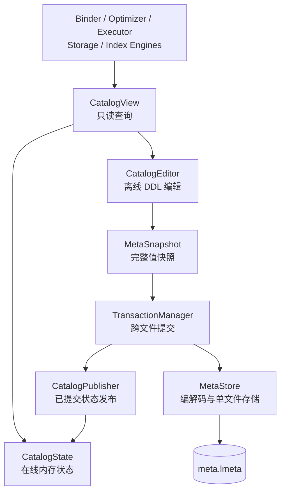
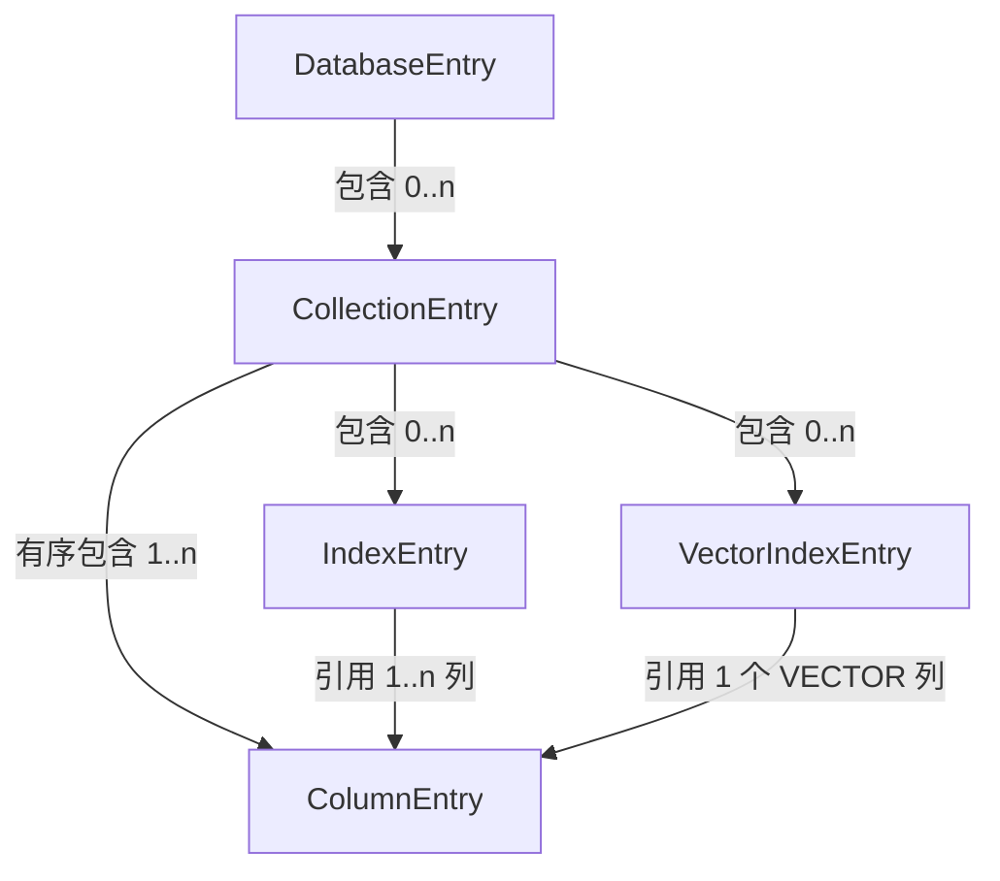
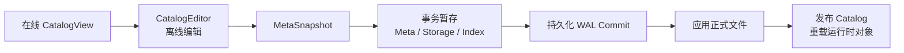

# 元数据

元数据描述数据库中“有哪些对象、对象如何命名以及对象之间如何关联”。LiteDB 将这些结构信息组织为 Catalog。Catalog 是名称绑定、Schema 构造、存储恢复和索引发现的共同依据。

Catalog 不保存用户记录、B+Tree 页面或 HNSW 图数据，但这些物理对象必须与 Catalog 定义保持一致。因此，元数据子系统不仅需要提供高效查询，还必须参与数据库事务。

## 设计目标

元数据子系统需要满足以下要求：

- 为 Binder、优化器和执行器提供只读查询；
- 维护数据库、集合、列和索引之间的引用完整性；
- 为每类对象分配稳定的内部 ID；
- 在不修改在线 Catalog 的情况下准备 DDL；
- 将完整 Catalog 编码为可校验、可恢复的持久化快照；
- 与集合和索引文件共同参与事务提交；
- 在文件损坏、截断或版本不兼容时拒绝加载。

## 总体结构

设计中存在三个不同边界：

| 层次 | 主要职责 |
| --- | --- |
| 元数据引擎 | 对象建模、查询、DDL 规则、离线编辑和在线发布 |
| 元数据存储 | 快照编解码、格式校验和 `meta.lmeta` 单文件可靠保存 |
| 事务与恢复 | 协调 Catalog、集合及索引文件的原子提交和崩溃恢复 |

元数据引擎和元数据存储相互协作，但不应合并成一个同时承担业务规则、文件格式和事务协议的大型组件。

## 元数据对象

- `DatabaseEntry` 表示数据库命名空间。
- `CollectionEntry` 保存集合身份以及列和索引的关联。
- `ColumnEntry` 保存列序、逻辑类型、可空性、默认值和注释。
- `IndexEntry` 保存标量索引的目标列、类型及唯一性声明。
- `VectorIndexEntry` 保存向量索引的目标列、距离度量和 HNSW 参数。

列定义会被投影为运行时 `CollectionSchema`，详细说明参见 [数据模型](../data_model/README.md)。索引定义独立存在于 Catalog 中，不属于 `CollectionSchema`。

## DDL 数据流

DDL 不直接修改在线 Catalog，而是在离线副本上生成变更后的完整快照，再通过事务发布：

WAL Commit 持久化之前，离线结果可以被丢弃；Commit 持久化之后，事务已经逻辑提交。如果文件应用或运行时发布失败，数据库必须通过恢复完成已提交写入，不能回滚到旧 Catalog。

## 章节导航

- [元数据引擎](metadata_engine/README.md)：介绍 Catalog 的内存对象、查询接口、
  离线编辑、快照和在线发布。
- [元数据存储](metadata_storage/README.md)：介绍 `meta.lmeta` 格式、编解码、
  单文件可靠保存以及启动加载。
- [事务与恢复](../transaction_and_recovery/README.md)：介绍跨 Catalog、集合和索引
  文件的提交协议与 WAL 恢复。

## 当前边界

- Catalog 采用完整快照持久化，不是增量元数据日志。
- DDL 是隐式语句级事务，尚未提供显式多语句事务。
- Entry 指针不能跨 Catalog 编辑或发布长期持有。
- `MetaStore` 的原子替换只覆盖 `meta.lmeta` 单文件。
- Catalog 与集合及索引文件的原子性由 `TransactionManager + WAL` 提供。
