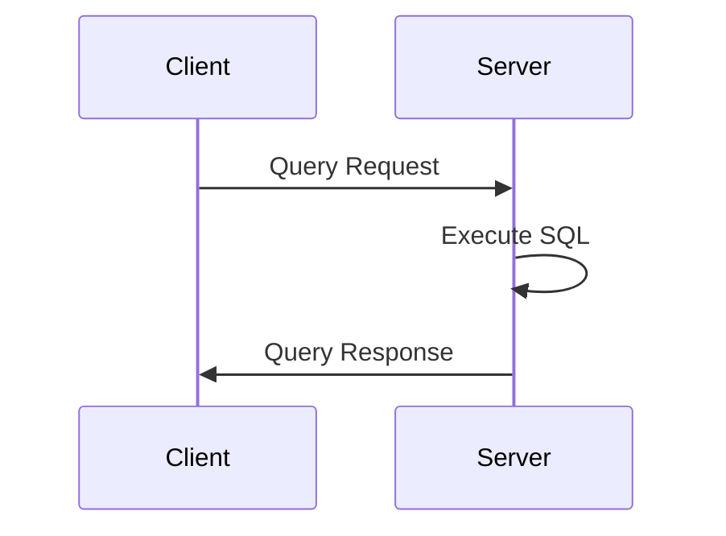

# 网络协议

本节详细介绍 LiteDB 数据库中服务端与客户端之间的网络通信协议。协议定义了客户端 SDK 与数据库服务端之间的通信规范，包括连接管理、消息传输、请求响应、错误处理以及数据序列化等内容。该协议基于 TCP/IP 协议实现，采用二进制消息格式，以保证通信效率和协议扩展能力。

## 整体架构

整体架构如下图所示：


客户端通过 SDK 封装用户请求，然后通过协议转换为二进制消息，再通过 TCP/IP 协议传输到服务端。服务端接收到消息后，通过协议解析为具体的请求，执行业务逻辑，并返回结果。

有关传输协议的详细说明见 [传输协议](../transport_protocol/README.md)。

## 请求模型

LiteDB 采用请求-响应模型，客户端发送请求到服务端，服务端处理请求并返回响应。

该模型的时序图如下图所示：



## 消息模型

所有网络通信均由二进制消息（Message）组成，每个消息包含：

- Header: 包含消息类型、长度、序列号等元数据
- Payload: 实际承载业务数据的有效负载

大致结构为：

```txt
+----------------+
| Header         |
+----------------+
| Payload        |
+----------------+
```

有关请求模型和消息模型的详细结构见 [消息协议](../message_protocol/README.md)。