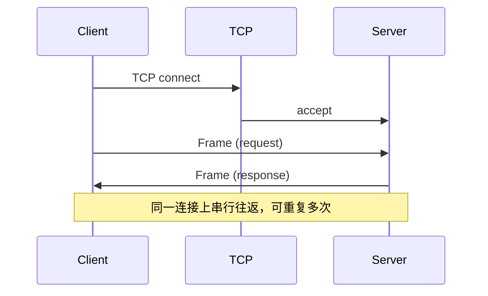

# 传输协议

传输层负责在 TCP 连接上可靠地收发完整消息帧。它不解释载荷业务含义，只负责先读满 16 字节消息头，再按头中的 `Payload Size` 读满载荷，并组装成一帧交给上层。消息头与各类 Payload 的字段定义见 [消息协议](../message_protocol/README.md)。

## 传输模型

| 项目 | 说明 |
| --- | --- |
| 承载协议 | TCP（基于 Asio） |
| 寻址 | `host` + `port`；示例默认 `127.0.0.1:5252` |
| 连接建立 | 客户端主动 `connect`；**无**应用层握手、版本协商、认证或 TLS |
| 连接内语义 | 严格的**请求–响应**：一方写完一帧后等待对端回一帧 |
| 多路复用 | **不支持**；同一连接上客户端不会并发发出多个未完成请求 |
| 多连接 | 服务端可为每个已接受连接启动独立处理协程；各连接互不共享会话状态 |



## 帧在字节流上的定界

TCP 提供的是字节流，不保留消息边界。LiteDB 用**长度前缀**定界：

1. 先读取固定 **16** 字节消息头。
2. 解析头中的 `Payload Size`（**仅为载荷字节数**，不含头）。
3. 若 `Payload Size > 0`，再精确读取该长度的载荷；若为 `0`，则本帧只有头部。
4. 整帧长度 = `16 + Payload Size`。

写入时将整帧一次性编码后写出：`encode_frame(header + payload)` → `async_write`。

```txt
TCP 字节流：
|---- Frame 1 ----|---- Frame 2 ----|---- Frame 3 ----| ...
| 16B Header | Payload | 16B Header | Payload | ...
```

## 读帧流程

对应 `async_read_frame(socket, max_frame_size)`：

1. `async_read` 恰好 16 字节头部。
2. `decode_frame_header`：校验版本、消息类型等。
3. 若 `payload_size > max_frame_size`，返回帧过大错误，**不再**继续读载荷。
4. 按 `payload_size` 分配缓冲区并 `async_read` 读满（可为 0）。
5. 返回完整 `Frame`（头部 + 载荷字节）。

默认 `max_frame_size` 为 `DefaultMaxFrameSize`（**16 MiB**）。服务端可通过 `ServerConfig.max_frame_size` 覆盖；该阈值针对的是 **Payload Size**，不是 `16 + Payload Size`。

## 写帧流程

对应 `async_write_frame(socket, frame)`：

1. 用消息协议将 `Frame` 编码为连续字节（头部字段 + 载荷）。
2. `async_write` 写完整个缓冲区。
3. IO 失败则返回网络错误。

注意：编码时头部里的 `Payload Size` 以实际 `payload` 向量长度为准。

## 连接生命周期

### 建立

- 服务端在配置的 `host`/`port` 上 `bind` + `listen`（`reuse_address` 开启）。
- 客户端解析地址并 `async_connect`。
- 连接成功后即可发送业务帧；常见做法是先发 `PingRequest` 探测连通性。

### 使用

- **客户端**：`roundtrip` = 写请求帧 → 读响应帧 → 校验响应 `Request ID` 与请求一致。
- **服务端**：每个连接循环 `async_read_frame` → 按 `Kind` 处理 → `async_write_frame` 回响应；处理细节见会话相关文档。

### 关闭

以下情况会导致连接结束（对端通常表现为读/写失败）：

- 任一方关闭套接字；
- 读帧 / 写帧 IO 失败；
- 读帧时协议头非法或载荷超限（读侧报错后服务端处理协程直接退出，**不一定**再写 Error 帧）；
- 服务端对「无法继续服务」的请求（如载荷无法解码、未知请求类型）在写出 Error 帧后主动结束该连接。

传输层本身**不**实现空闲超时、心跳定时器或读超时；`Ping`/`Pong` 由应用按需发起。

## 传输层错误

网络读写封装可能产生的错误类别包括：

| 错误 | 典型原因 |
| --- | --- |
| IO 错误 | 连接重置、对端关闭、读写中断等 |
| 协议错误 | 头部过短、版本不匹配、非法 `Kind` 等（在解析头时发现） |
| 帧过大 | `Payload Size` 超过配置的 `max_frame_size` |

这些错误发生在「尚未得到合法完整帧」或「无法写完帧」阶段；业务 SQL 失败则仍通过合法的 `ErrorResponse` 帧返回，不一定断开连接。

## 当前限制

- 仅 TCP 明文，无 TLS / mTLS。
- 无连接级压缩、无分片与流式传输；单次响应整帧返回。
- 无传输层超时与自动重连；由调用方决定。
- 单连接串行 RPC，吞吐受往返延迟与单帧大小共同约束。
