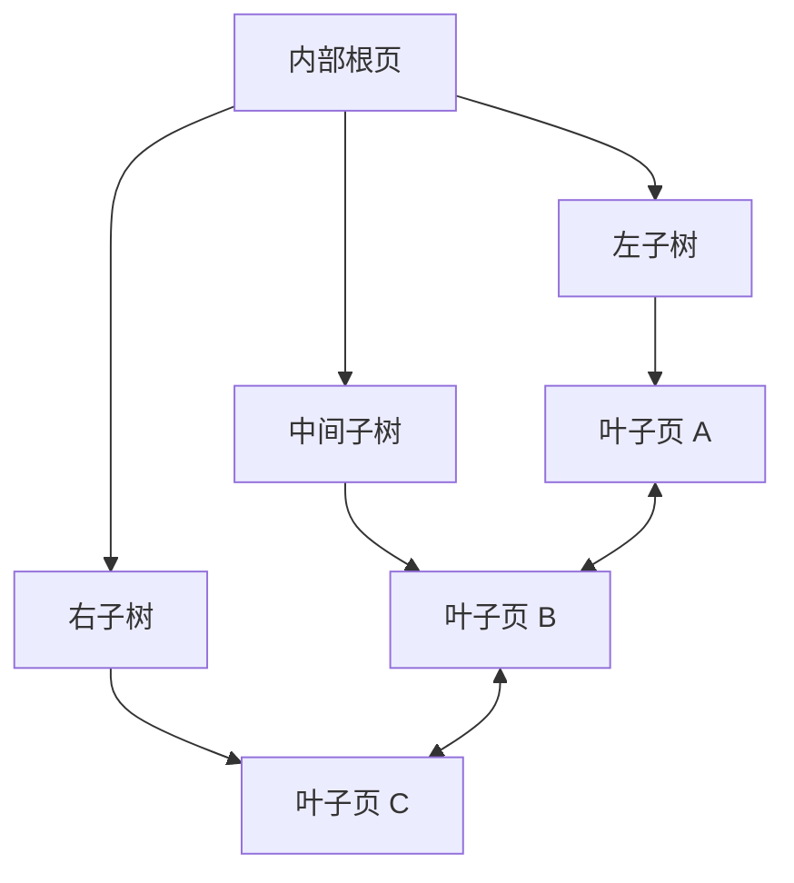

# B+ 树实现

`BTreeIndex` 是当前标量索引的持久化有序后端。内部节点负责导航，所有用户条目都保存在叶子节点中，叶子节点通过双向链表连接。

## 树的结构

内部页保存：

- 一个 `first_child`；
- 一组“分隔键 + 右侧子页”的条目。

分隔键等于右侧子树中的最小完整键。这里的“完整键”是 `(ScalarIndexKey, RecordId)`，因此重复标量键跨页分布时仍可被准确导航。

叶子页保存有序的 `(key, RecordId)` 条目，以及前驱、后继叶子页 ID。

## 查找

等值查找先沿内部分隔键下降到可能包含目标键的叶子页，再沿相邻叶子页收集所有相同标量键对应的 `RecordId`。

由于内部树按完整键排序，而等值查询只指定标量键，查找逻辑必须覆盖重复键可能跨越叶子页边界的情况。

## 插入与分裂

插入过程为：

1. 定位目标叶子页；
2. 按完整键顺序插入条目；
3. 页面仍可编码时直接写回；
4. 页面溢出时拆分为左右两页；
5. 把右页最小键提升为父页分隔键；
6. 父页溢出时递归拆分；
7. 原根拆分时创建新的内部根页。

树高只在根分裂时增加。页是否溢出以编码后的字节容量为准，而不是固定的条目数量，因为字符串键是变长的。

## 删除与页面回收

删除以 `(key, RecordId)` 为精确目标。叶子变空后，树会：

- 修正相邻叶子的链表指针；
- 从父页移除对应子树；
- 递归清理空内部页；
- 在根只剩一个子树时折叠根；
- 把不再使用的页面加入空闲页链表。

当前删除重点是正确移除空子树和回收页面，并未实现传统教科书中对每个“未满但非空”节点的借位或合并。因此文件可能保留利用率较低的非空页面；这不影响查询正确性，但会影响长期空间紧凑度。

## 批量构建

`bulk_load` 用于新索引的全量创建：

1. 按完整键排序输入；
2. 顺序装填叶子页并建立叶链；
3. 自底向上构造内部层；
4. 最后一次性发布根页 ID 和条目总数。

与逐条插入相比，它减少随机页面修改，并能直接产生有序叶子层。该接口要求目标索引为空。

## 范围游标

范围游标不会预先物化全部结果。它：

1. 根据下界定位起始叶子和槽位；
2. 顺序读取当前叶子的条目；
3. 沿 `next_leaf` 进入下一页；
4. 达到上界时停止。

这使范围扫描的额外内存与结果总量解耦。反向链指针主要用于维护和结构完整性，当前公开范围游标按升序前进。

## 空树与根发布

根页 ID 为 `0` 表示空树。文件头还保存条目总数。树结构修改后，后端更新页面和头部状态；批量构建则在树完全形成后再发布新根。

这些写入保证单个 B+ 树文件能被校验和重新打开，但不能单独提供“集合记录与所有索引同时提交”的数据库事务语义。
