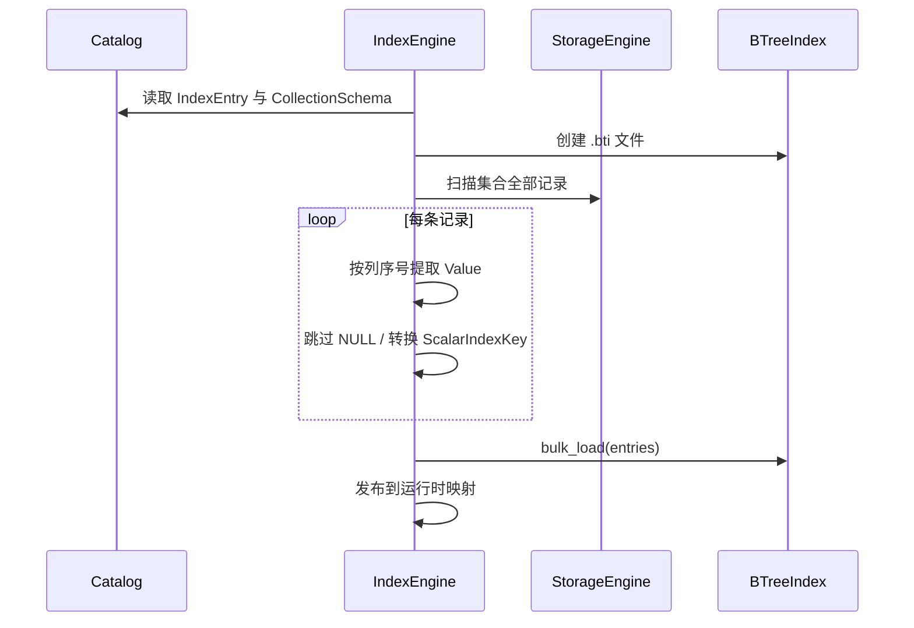

# 索引引擎

`IndexEngine` 是标量索引子系统的协调层。它不实现树算法，而是负责把 Catalog 中的索引定义、`CollectionSchema`、`StorageEngine` 中的记录以及具体索引后端连接起来。

## 运行时组织

每个已打开的索引由一个 `IndexStore` 表示。`IndexEngine` 同时维护：

- 按索引 ID 查找的映射；
- 按集合 ID 分组的索引；
- 索引描述符与具体后端的所有权。

`IndexDescriptor` 保存：

- 索引 ID；
- 集合 ID；
- 列 ID及其在记录中的序号；
- 键的逻辑类型；
- 索引种类；
- 是否唯一。

这使记录变更时不必重新搜索 Catalog 或集合模式。

## 创建索引



只有 B+ 树类型会被接受。目标列必须存在且不能是 `VECTOR`。当前实现使用 `IndexEntry::column_id()` 返回的第一个列 ID，因此一个运行时索引只覆盖一个列。

批量构建失败时，`IndexEngine` 不发布对应 `IndexStore`，并删除不完整的索引文件。

## 恢复与集合重载

`restore_all` 并不是在当前映射中逐个追加。它先创建临时引擎并打开全部索引，成功后再交换内部状态。这样，打开某个损坏索引失败时，调用方不会看到半套可用索引。

`reload_collection` 使用相同思想，但粒度缩小到单个集合：

1. 在临时集合中打开该集合应有的索引；
2. 所有索引均成功后，替换旧的集合索引；
3. 其他集合不受影响。

## 写入前准备

`prepare_insert`、`prepare_update` 和 `prepare_delete` 把记录转换为后续写入所需的绑定：

```text
索引 ID + 旧键（可选）+ 新键（可选）
```

其中：

- `NULL` 转换为空键，表示该索引无需写入；
- 非空值必须与索引描述符中的类型完全一致；
- 插入和更新到新键时会提前检查唯一约束；
- 更新时只有旧键和新键不同才生成实际变更。

准备阶段不会修改索引文件，因此上层可以在持久化动作开始前发现大部分确定性错误。

## 应用记录变更

### 插入

`on_insert` 把同一个 `RecordId` 写入所有非空索引键。如果后续索引失败，它会按相反方向删除此前已经插入的条目。

### 删除

`on_delete` 从所有相关索引删除 `(key, RecordId)`。失败时会尝试重新插入此前已经删除的条目。

### 更新

对每个发生变化的键：

1. 插入新键；
2. 删除旧键；
3. 失败时尝试撤销本次以及此前索引上的变更。

先插入新键可以在移除旧入口前发现唯一键冲突。

这些补偿是进程内的错误恢复手段。进程崩溃、刷盘顺序以及数据文件与多个索引文件之间的持久化一致性，仍由 `TransactionManager` 和 WAL 保证。

## 查询入口

`IndexEngine` 对外提供：

- 按 ID 获取索引视图；
- 列出集合上的索引；
- 等值查找；
- 创建范围游标；
- 范围结果收集。

范围查询只对 `OrderedScalarIndex` 有意义。基础 `ScalarIndex` 的默认实现会返回“不支持范围扫描”，而当前 B+ 树实现属于有序索引。

## 所有权边界

`IndexEngine` 拥有索引运行时对象，但不拥有：

- Catalog 元数据的持久化；
- 集合记录文件；
- 跨文件事务；
- 查询计划中的索引选择策略。

因此它是索引生命周期和变更协调器，而不是通用存储基类或数据库事务协调器。
