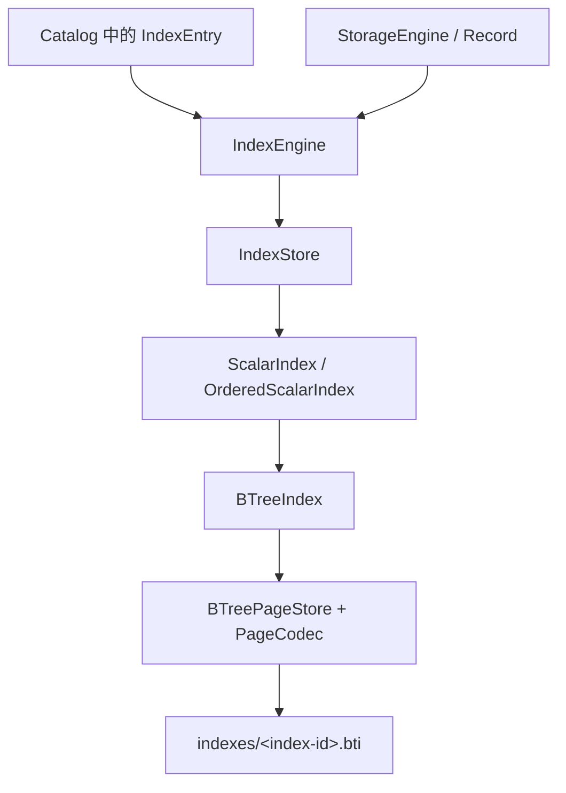

# 标量索引总览

LiteDB 的标量索引是一套持久化的有序索引系统。它把集合记录中的单个标量列映射为：

```text
标量键 -> RecordId
```

当前唯一的后端是 B+ 树。索引文件与集合数据文件彼此独立，由 `IndexEngine` 根据元数据创建、恢复和维护。

## 分层结构



各层职责如下：

| 层 | 主要职责 |
| --- | --- |
| `IndexEngine` | 将索引元数据、集合模式和记录变更连接起来 |
| `IndexStore` | 保存索引描述符，检查键类型与唯一性 |
| `ScalarIndex` | 定义插入、删除、等值查询与批量装载接口 |
| `OrderedScalarIndex` | 增加范围扫描与游标能力 |
| `BTreeIndex` | 实现持久化 B+ 树算法 |
| `BTreePageStore` | 管理文件头、页面读写、空闲页链表与刷盘 |
| `BTreePageCodec` | 编解码固定大小的物理页面 |

## 索引的生命周期

### 创建

创建索引时，`IndexEngine`：

1. 从 Catalog 读取 `IndexEntry`；
2. 解析目标集合和目标列；
3. 创建 `indexes/<index-id>.bti`；
4. 全量扫描集合记录；
5. 跳过 `NULL`，把其余值转换为 `ScalarIndexKey`；
6. 调用后端的 `bulk_load` 构建索引。

任何一步失败，尚未完成的索引文件都会被清理，索引也不会加入运行时映射。

### 打开与恢复

数据库打开时，`restore_all` 根据 Catalog 中的定义重新打开所有索引。恢复先在一个临时 `IndexEngine` 中完成，全部成功后才交换到当前实例，因此不会暴露“只恢复了一部分索引”的运行时状态。

集合级元数据发生变化时，`reload_collection` 也采用先构建、后替换的方式，只刷新目标集合的索引集合。

### 记录变更

插入、更新和删除分为两个阶段：

1. `prepare_*` 从记录中提取索引键，并提前执行类型、唯一性等检查；
2. `on_*` 真正修改各个索引文件。

更新仅处理值确实发生变化的索引键，并采用“先插入新键、再删除旧键”的顺序。跨多个索引发生失败时，`IndexEngine` 会尝试补偿已经完成的修改；但这只是运行时的局部补偿，不是数据库级持久化事务。

跨数据文件、索引文件和 Catalog 的原子提交由事务与 WAL 层负责，详见后续的“事务与恢复”章节。

## 查询能力

标量索引支持：

- 等值查询；
- 全范围扫描；
- 带上下界的范围扫描；
- 开区间和闭区间；
- 流式范围游标。

`scan_range` 会把结果收集为一个数组；游标接口则沿叶子页逐项返回，更适合结果集较大的扫描。

## 当前实现边界

- 仅实现 B+ 树后端；
- 每个运行时索引只读取 `IndexEntry` 的第一个列 ID；
- SQL 创建索引的路径目前也只生成单列索引；
- `NULL` 不写入索引，因此等值和范围扫描都不会返回 `NULL` 记录；
- 向量值不属于标量索引键，向量检索由独立的向量索引系统负责；
- 索引文件自身的刷盘不等于跨文件提交，数据库级原子性仍属于事务层。

Catalog 的模型可以保存列 ID 列表，但当前执行路径尚未实现复合键编码。文档和调用方都不应把这种元数据表达能力误解为已经支持复合索引。

## 阅读顺序

建议依次阅读：

1. [索引引擎](../index_engine/README.md)：理解索引如何接入集合与记录变更；
2. [键与约束](../keys_and_constraints/README.md)：理解可索引类型、排序和唯一性；
3. [B+ 树](../btree/README.md)：理解树结构、分裂、删除与范围扫描；
4. [索引文件格式](../file_format/README.md)：理解磁盘头、节点页和空闲页。
