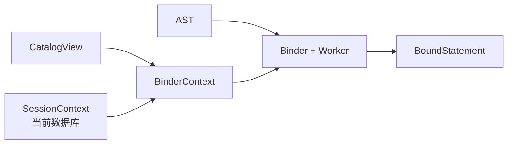

# 绑定器

绑定器将 Parser 产生的名称型 AST 转换为具有确定对象身份和逻辑类型的 Bound AST。Parser 判断语法能否成立；Binder 判断该语句在当前会话和 Catalog 中是否具有合法、唯一的含义。

## 输入与上下文



`BinderContext` 组合只读 `CatalogView` 和会话状态。Catalog 提供数据库、集合、列与索引定义；会话状态提供 `USE` 选中的当前数据库。

绑定器只读取这些状态，不修改在线 Catalog。

## 名称解析

Binder 将用户可见名称解析为稳定内部 ID：

| SQL 名称 | 绑定结果 |
| --- | --- |
| 数据库名 | `DatabaseId` |
| 集合名 | `CollectionId` 及所属数据库 |
| 列名 | `ColumnId`、列序和逻辑类型 |
| 标量索引名 | `IndexId` |
| 向量索引名 | `VIndexId` |

未限定集合名依赖当前数据库。如果会话尚未选择数据库，要求数据库上下文的语句会返回 `DatabaseNotSelected`。限定符必须与绑定范围一致；找不到对象或名称存在歧义时，绑定失败。

稳定 ID 会继续进入逻辑计划和物理计划，使后续阶段不必重复按名称查找对象身份。

## 表达式绑定

表达式绑定递归处理 AST，并为每个表达式生成具体的 `BoundExpression`。主要工作包括：

- 将列引用解析为列 ID、名称和类型；
- 解析函数名并检查参数；
- 推导字面量、向量和运算结果的逻辑类型；
- 检查一元、二元、`BETWEEN`、`IN` 和 `LIKE` 的操作数；
- 处理别名和通配符展开；
- 在允许的位置插入或表达类型转换；
- 保留原始 AST 位置用于后续诊断。

绑定后的表达式不再依赖模糊名称。例如列引用不仅保存 `title`，还保存目标集合和列的 ID，因此优化器和执行器可以直接使用。

## 语句绑定

不同语句由专用 Binder Worker 处理。

### 查询

`SELECT` 绑定目标集合、投影表达式、过滤条件、排序项以及 `LIMIT/OFFSET`。通配符依据集合列顺序展开，输出名称和类型在绑定阶段确定。

### INSERT

Binder 将显式列列表映射到 Schema 列序，检查值数量与类型，并为未提供的列应用默认值或 `NULL`。缺少不可空列值时，语句在进入执行器前失败。

### UPDATE 与 DELETE

Binder 解析目标集合和过滤表达式。`UPDATE` 还会把每个赋值目标绑定为具体列，并检查新值表达式能否用于目标类型。

### DDL 与元数据命令

创建和删除数据库、集合及索引时，Binder 检查对象存在性、名称冲突、目标列类型以及索引参数。`USE`、`SHOW` 和 `DESCRIBE` 同样在此解析目标对象。

Binder 的检查用于尽早产生清晰错误；存储和元数据引擎仍会在写入边界重新验证自身不变量。

## Bound AST

Bound AST 与 Parser AST 结构相似，但语义更强：

```text
AST ColumnReference("id")
    ↓ Catalog lookup
BoundColumnRefExpression
    collection_id = ...
    column_id = ...
    column_name = "id"
    type = BIGINT
```

Bound AST 是 Logical Planner 的唯一输入。Planner 不需要重新推断名称和类型，也不应绕回 Parser AST 查询语法细节。

## 错误模型

`BinderError` 区分：

- 未选择数据库；
- 数据库、集合、列或索引不存在；
- 重复列、歧义别名或无效限定符；
- 不支持的语句或表达式；
- 类型不合法、值数量不匹配；
- 向不可空列提供 `NULL`。

错误携带对应 AST 节点位置。`Session` 将其包装成 `SessionError`，同时保留底层 cause。

## 示例

对查询：

```sql
SELECT title
FROM documents
WHERE id >= 100;
```

Binder 的关键结果可以概括为：

```text
BoundSelectStatement
├── database_id: 1
├── collection_id: 7
├── projection
│   └── ColumnRef(column_id=12, type=VARCHAR(200))
└── predicate: >= : BOOLEAN
    ├── ColumnRef(column_id=11, type=BIGINT)
    └── Literal(100, type=BIGINT)
```

这里的 ID 仅为示意。重要的是，从此阶段开始，对象身份和表达式类型已经确定。

## 当前边界

- 绑定范围以单集合查询为主，当前没有 Join 和子查询作用域。
- Binder 依赖语句开始时取得的 Catalog 与会话状态。
- 绑定成功不表示数据访问一定成功；文件、索引和事务错误属于执行阶段。
- 类型检查用于提前报错，持久化写入仍由 StorageEngine 执行最终 Schema 校验。
- Catalog 中可表达但运行时尚未落实的约束，不应仅因 Binder 接受就视为已获得完整保证。
