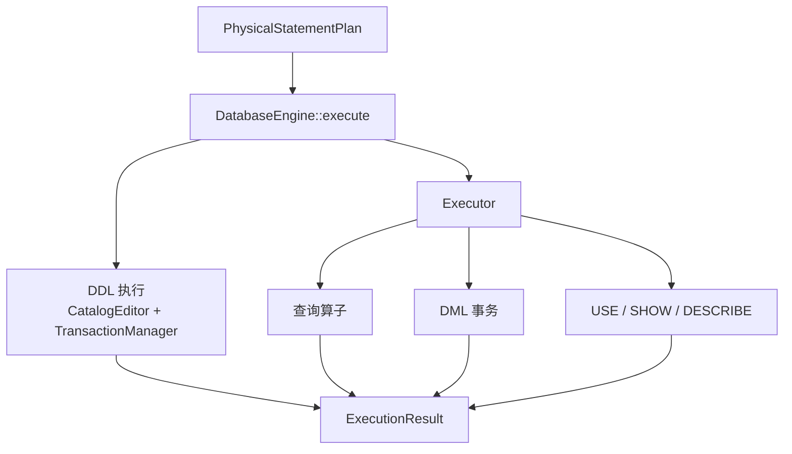
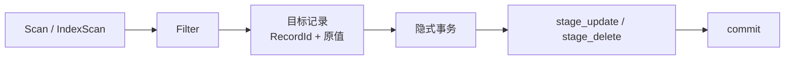

# 执行器

执行器接收 `PhysicalStatementPlan`，调用元数据、存储、标量索引、向量索引和事务组件，并生成 `ExecutionResult`。它是 SQL 计划与数据库运行时状态之间的边界。

DDL 由 `DatabaseEngine` 执行；查询、DML 以及 `USE/SHOW/DESCRIBE` 由 `Executor` 执行。两者共同构成 SQL 执行层。

## 执行分派

数据库处于 `recovery_required` 状态时，`DatabaseEngine` 会在执行任何新计划前拒绝请求，防止在未完成恢复的持久状态上继续工作。

## 查询执行

查询计划由 `execute_physical` 递归执行。每个算子先取得子节点结果，再完成自身操作：

| 物理算子 | 执行行为 |
| --- | --- |
| `PhysicalSeqScan` | 通过 StorageEngine 遍历集合记录 |
| `PhysicalIndexScan` | 通过 IndexEngine 查找记录 ID，再从存储加载记录 |
| `PhysicalVectorSearch` | 通过 VectorIndexEngine 取得向量候选并加载记录 |
| `PhysicalFilter` | 使用 ExpressionEvaluator 计算谓词并筛选行 |
| `PhysicalProjection` | 计算投影表达式和输出列 |
| `PhysicalSort` | 物化输入并按排序表达式比较 |
| `PhysicalLimit` | 应用 OFFSET 和 LIMIT |

当前算子间传递 `PipelineResult`，其中包含列描述和 `PipelineRow` 集合。行同时保存源记录与表达式输出：

- 源记录的 `RecordId` 和原始数据用于 UPDATE、DELETE 和回表处理；
- evaluation record 为过滤、投影和排序提供列值；
- output values 最终转换为客户端可见行。

因此当前执行模型是递归、物化式执行，不是逐行 `next()` 火山模型，也不是向量化批处理流水线。

## 表达式求值

`ExpressionEvaluator` 在运行时计算 Bound Expression，包括：

- 列引用和字面量；
- 一元、二元和布尔表达式；
- 类型转换；
- `BETWEEN`、`IN` 和 `LIKE`；
- 标量函数与向量距离函数。

Binder 已经确定表达式类型和列身份；Evaluator 只针对当前记录计算值。求值失败会转换为带源码位置的 `ExecutionError`。

## INSERT

执行 `INSERT` 时：

1. 找到目标集合存储；
2. 对已经按 Schema 排列的值表达式求值；
3. 开启隐式事务；
4. 调用 `stage_insert` 暂存记录及相关索引变化；
5. 提交事务；
6. 返回受影响行数 1。

暂存或求值失败时执行器中止事务。事务管理器负责协调记录文件、标量索引、向量索引和 WAL，而不是由 Executor 分别修改各个正式文件。

## UPDATE 与 DELETE

二者先执行物理输入树，找出目标记录：

`UPDATE` 针对每条记录计算赋值表达式，按列序替换对应值，再暂存旧值和新值。`DELETE` 暂存记录 ID 和旧记录。所有目标行属于同一个语句级事务；中途失败时整条语句中止，不提交已处理的前缀。

## DDL

创建和删除数据库、集合及索引由 `DatabaseEngine` 执行，而普通 `Executor` 会拒绝直接执行 DDL。典型流程为：

1. 从在线 `CatalogView` 构造离线 `CatalogEditor`；
2. 在离线 Catalog 上执行结构修改；
3. 生成完整 `MetaSnapshot`；
4. 暂存 Catalog 以及需要创建、删除或替换的存储和索引文件；
5. 通过 `TransactionManager` 提交；
6. 发布新 Catalog 并恢复相应运行时对象。

这种分流让 Executor 专注计划算子和行操作，让 `DatabaseEngine` 负责跨 Catalog、Storage 和 Index Engine 的生命周期协调。

## 元数据命令

- `USE` 返回目标数据库身份；成功后由 `Session` 更新当前数据库。
- `SHOW DATABASES/COLLECTIONS/INDEXES/VINDEXES` 从 Catalog 构造行集。
- `DESCRIBE` 加载集合 Schema，并返回列名、类型、可空性、唯一性和注释。

这些命令与普通查询共用 `ExecutionResult`，但不经过集合扫描算子。

## 执行结果

`ExecutionResultKind` 包含：

| 类型 | 内容 |
| --- | --- |
| `Command` | 受影响行数 |
| `RowSet` | 输出列定义和记录行 |
| `UseDatabase` | 选中的数据库 ID 和名称 |

`RowSet` 的每列包含名称和逻辑类型，每行包含有序 `Value`。协议层将这一内部结果编码为客户端响应。

## 错误与提交语义

执行错误可以来自无效计划、元数据、Schema、存储、索引、事务、WAL 或表达式求值。Executor 将底层错误包装为 `ExecutionError` 并保留 cause；`Session` 再统一转换为 `SessionError`。

WAL Commit 持久化之前的失败可以中止事务。Commit 已持久化之后，事务在逻辑上已经成功；若正式文件应用或运行时重载失败，数据库会进入需要恢复的状态，而不能把已提交事务报告成可安全重试的普通未提交失败。

自动 checkpoint 在成功的持久化写语句之后按阈值触发。checkpoint 失败记录为维护指标，不应把已经提交的用户语句伪装成执行失败。

## 并发与生命周期

`Session::execute_sql` 在 `DatabaseEngine` 互斥锁下完成解析到执行的整个流程。TransactionManager 还维护单写者所有权，但当前 SQL 入口本身已经串行化同一引擎上的语句。

物理计划和中间行只在当前调用期间存在。查询返回的 `ExecutionResult` 按值拥有列和行，不借用 StorageCursor 或 Catalog Entry 指针。

## 当前边界

- 当前没有显式 `BEGIN/COMMIT/ROLLBACK` SQL，多次语句不能组成一个用户事务。
- 没有 MVCC、快照隔离、锁管理器或并行查询执行。
- 查询算子物化完整中间行集，大结果集可能占用较多内存。
- 排序是内存中的阻塞算子，没有外部排序或 spill。
- DML 是语句级原子提交，但这不等于 StorageEngine 单独提供无 WAL 的崩溃原子性。
- 当前没有流式结果协议、执行取消、资源配额或公开的运行时 profile。
