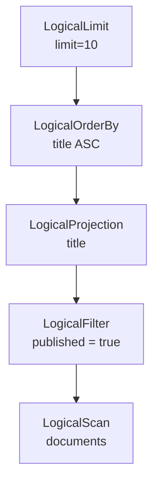

# 逻辑计划器

逻辑计划器把 `BoundStatement` 转换为 `LogicalStatementPlan`。绑定结果已经确定对象和类型；逻辑计划进一步回答“为了完成语句，需要执行哪些关系操作”，但尚不决定使用顺序扫描还是索引扫描。

## 两层计划模型

LiteDB 将计划分为语句计划和算子节点：

- `LogicalStatementPlan` 表示一条完整 SQL 的类别和语句级参数。
- `LogicalPlanNode` 表示查询或行修改所需的关系算子树。

DDL、`USE`、`SHOW` 和 `INSERT` 主要由语句计划携带参数。`SELECT` 包含查询根节点；`UPDATE` 和 `DELETE` 包含用于选出目标记录的输入树。

## 逻辑算子

| 逻辑节点 | 语义 |
| --- | --- |
| `LogicalScan` | 读取一个集合，是查询树的叶节点 |
| `LogicalFilter` | 保留谓词求值为真的记录 |
| `LogicalProjection` | 计算并选择输出表达式 |
| `LogicalOrderBy` | 按一个或多个表达式排序 |
| `LogicalLimit` | 应用 `LIMIT` 和 `OFFSET` |
| `LogicalVectorSearch` | 使用已匹配的向量索引表达 Top-K 检索 |

`LogicalVectorSearch` 通常不是初始计划直接生成的，而是 Optimizer 识别向量 Top-K 模式后产生。

## SELECT 计划

对以下查询：

```sql
SELECT title
FROM documents
WHERE published = true
ORDER BY title
LIMIT 10;
```

逻辑树可以表示为：



根节点代表最终操作，执行和数据流从叶节点向根节点推进。SQL 的文本顺序并不等同于计划树的处理顺序。

## DML 计划

`INSERT` 的值已经由 Binder 按目标 Schema 排列，因此逻辑语句计划主要保存集合身份和值表达式。

`UPDATE` 和 `DELETE` 必须先定位目标记录。Logical Planner 为二者构造以 `Scan` 为起点、可包含 `Filter` 的输入树：

```text
UpdatePlan / DeletePlan
├── target collection
├── input
│   └── Filter(...)
│       └── Scan(collection)
└── assignments        # 仅 UPDATE
```

执行器先运行输入树获得记录 ID 和原始记录，再在一个隐式事务中暂存更新或删除。

## 命令计划

以下语句不需要通用查询算子树，但仍统一表示为逻辑语句计划：

- `USE`；
- 数据库、集合、标量索引和向量索引的创建与删除；
- `SHOW DATABASES/COLLECTIONS/INDEXES/VINDEXES`；
- `DESCRIBE`；
- `INSERT`。

这种统一入口允许 Optimizer 和 Physical Planner 按语句种类分派，同时避免把 DDL 强行表示成扫描树。

## 计划属性

逻辑计划保存已经绑定的：

- 数据库、集合、列和索引 ID；
- 用户可见名称；
- 表达式及其逻辑类型；
- Schema 和索引选项；
- AST 源码位置；
- `IF EXISTS`、`IF NOT EXISTS`、排序方向和限制数量等语义参数。

计划节点通过独占所有权构成树。Optimizer 可以克隆或重建节点，但必须保持语句语义和源码位置。

## 与相邻阶段的边界

| 阶段 | 决策 |
| --- | --- |
| Binder | 名称和表达式“是什么意思” |
| Logical Planner | 需要哪些关系操作 |
| Optimizer | 哪些等价改写更合适 |
| Physical Planner | 采用哪些具体执行算子 |

Logical Planner 不枚举索引、不读取记录，也不提交事务。初始 `LogicalScan` 保持访问方法中立，索引选择由 Optimizer 使用 Catalog 完成。

## 错误模型

计划阶段主要拒绝空输入和不支持的 Bound Statement。大多数用户语义错误应已在 Binder 报告；如果 Binder 已产生合法对象而 Planner 无法处理，通常表示功能边界或内部阶段契约不匹配。

`PlannerError` 保留语句位置，并由 `Session` 转换为统一错误。

## 当前边界

- 查询树当前覆盖 Scan、Filter、Projection、OrderBy 和 Limit。
- 没有 Join、Aggregate、Set Operation、子查询和窗口算子。
- 初始逻辑计划不进行基于统计信息的访问路径选择。
- 逻辑计划是内部结构，当前没有公开 `EXPLAIN` 输出协议。
- `UPDATE` 和 `DELETE` 的目标选择复用查询节点，但 DML 提交仍属于 Executor 和 TransactionManager。
