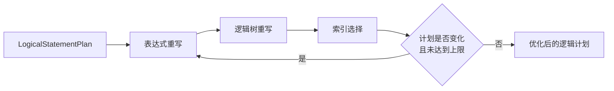

# 优化器

优化器在不改变 SQL 语义的前提下重写逻辑计划。LiteDB 当前实现是固定点迭代的规则优化器，并使用 Catalog 进行简单索引选择；它不是依赖统计信息和代价估算的成本优化器。

## 优化流程



默认最多执行 8 轮，使一次改写暴露出的新机会可以在后续轮次处理，同时防止错误规则导致无限循环。关闭优化器时，系统返回语义等价的计划副本。

## 优化选项

| 选项 | 默认值 | 作用 |
| --- | ---: | --- |
| `enabled` | `true` | 启用全部优化 |
| `enable_constant_folding` | `true` | 折叠可在计划期确定的表达式 |
| `enable_boolean_simplification` | `true` | 简化布尔表达式 |
| `enable_filter_elimination` | `true` | 消除恒真的 Filter |
| `enable_index_selection` | `true` | 选择标量或向量索引 |
| `max_passes` | `8` | 固定点迭代上限 |

这些选项是内部构造参数，当前不是公开 SQL 会话配置。

## 表达式重写

优化器递归克隆和重写 Bound Expression，当前主要包括：

- 对可安全求值的常量表达式进行折叠；
- 简化布尔表达式；
- 将恒真过滤 `Filter(true)` 替换为其子节点；
- 保留无法证明等价的表达式，不进行激进改写。

规则必须保持类型、NULL 语义和源码位置。运行期依赖列值或外部状态的表达式不能在计划期求值。

## 标量索引选择

当 `Filter` 的直接子节点是 `LogicalScan` 时，优化器检查谓词是否能形成单列索引查找。目前可以识别：

- `column = constant`；
- `column < constant`、`<=`、`>`、`>=`；
- 常量位于比较操作符左侧的等价形式；
- `column BETWEEN lower AND upper`。

优化器把常量转换为标量索引键，然后在 Catalog 中寻找目标列上的可用索引。等值查找可使用支持该操作的索引；范围查找要求 B+Tree。

选择结果作为 `LogicalScanIndexHint` 写入扫描节点，包括索引 ID、名称、类型和查询边界。原有 `Filter` 仍然保留，用于验证候选记录并保持完整谓词语义。

```text
Filter(id >= 100)
└── Scan(documents)

          ↓

Filter(id >= 100)
└── Scan(documents, index_hint=BTree[id, lower=100 inclusive])
```

当前实现不是成本比较：只要模式和索引能力匹配，就选择相应索引，不估计顺序扫描与索引扫描的相对代价。

## 向量 Top-K 改写

优化器识别以下形态：

```sql
SELECT ..., distance(embedding, [query vector]) AS score
FROM documents
WHERE ...
ORDER BY score ASC
LIMIT K OFFSET N;
```

当排序表达式、方向、常量查询向量、目标向量列、距离度量与 Catalog 中的 HNSW 索引匹配时，普通：

```text
Limit → OrderBy → Projection → [Filter] → Scan
```

会被改写为包含 `LogicalVectorSearch` 的计划。搜索请求数量使用 `K + N`，随后仍保留排序和 Limit，以正确应用最终顺序和偏移。可选过滤谓词也会随搜索节点传播。

如果缺少匹配索引、度量不一致、查询向量不是常量或计划形态不匹配，优化器保留原计划，由普通扫描、距离求值和排序完成查询。

## 语句覆盖

Optimizer 重写 `SELECT`、`UPDATE` 和 `DELETE` 中的逻辑输入树。`INSERT`、DDL、`USE`、`SHOW` 和 `DESCRIBE` 没有关系算子优化机会，按值克隆或直接传递其语句计划。

## 正确性边界

优化规则的首要要求是语义等价，而不是“看起来更快”：

- 索引返回的是候选记录，Filter 负责最终谓词判断；
- 范围边界必须保留 `<`、`<=`、`>`、`>=` 的包含性；
- 向量索引必须匹配列、维度和距离度量；
- `OFFSET` 要求搜索至少 `LIMIT + OFFSET` 个候选；
- 无法证明安全时必须回退到原计划。

## 当前边界

- 没有统计信息、基数估计、成本公式和计划成本比较。
- 没有 Join 顺序、谓词下推、投影裁剪或多索引组合框架。
- 标量索引选择面向直接的单列比较和 `BETWEEN`。
- 向量优化只识别特定的 `ORDER BY distance LIMIT` 计划形态。
- 优化器生成索引提示，但不验证物理文件健康；运行期错误由索引引擎和 Executor 报告。
- 当前没有用户可见的 hint、`EXPLAIN` 或优化器跟踪接口。
