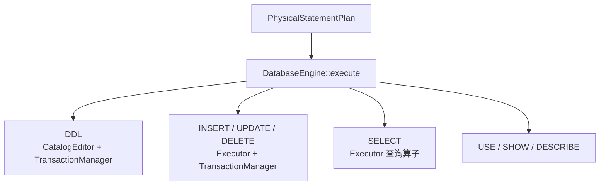

# SQL 处理流程总览

LiteDB 将一条 SQL 语句逐步转换为可执行计划，再由执行器访问元数据、存储和索引并返回结果。各阶段使用独立的中间表示，使语法识别、语义检查、计划优化和数据访问保持清晰边界。

## 总体流程

```mermaid
flowchart LR
    SQL["SQL 文本"]
    Parser["Parser"]
    AST["AST<br/>StatementNode"]
    Binder["Binder"]
    Bound["BoundStatement"]
    Logical["Logical Planner"]
    LPlan["LogicalStatementPlan"]
    Optimizer["Optimizer"]
    OPlan["优化后的逻辑计划"]
    Physical["Physical Planner"]
    PPlan["PhysicalStatementPlan"]
    Executor["DatabaseEngine / Executor"]
    Result["ExecutionResult"]

    SQL --> Parser --> AST --> Binder --> Bound --> Logical --> LPlan
    LPlan --> Optimizer --> OPlan --> Physical --> PPlan --> Executor --> Result
```



`Session::execute_sql` 是生产路径的编排入口。它在同一个数据库互斥区间内依次调用各阶段；任一阶段失败都会停止后续处理，并将领域错误包装为带源码位置的 `SessionError`。

| 阶段 | 输入 | 输出 | 核心职责 |
| --- | --- | --- | --- |
| Parser | SQL 文本 | AST | 词法分析、语法识别、记录源码位置 |
| Binder | AST、Catalog、会话状态 | Bound AST | 名称解析、对象绑定、类型与语义检查 |
| Logical Planner | Bound AST | 逻辑语句计划 | 将语句组织为关系算子树或命令计划 |
| Optimizer | 逻辑计划、Catalog | 优化后的逻辑计划 | 等价重写、简单索引选择、向量 Top-K 改写 |
| Physical Planner | 优化后的逻辑计划 | 物理计划 | 选择具体扫描和执行算子 |
| Executor | 物理计划、运行时引擎 | 执行结果 | 执行查询或命令，协调数据访问和事务 |

## 中间表示

各阶段不会直接修改前一阶段的对象来“补字段”，而是产生职责更明确的表示：

- AST 保留用户写出的语法结构和源码位置，但不保证名称存在或类型合法。
- Bound AST 将名称解析为数据库、集合、列和索引的稳定 ID，并为表达式确定逻辑类型。
- 逻辑计划描述需要完成的关系操作，不固定具体访问路径。
- 优化后的逻辑计划保持语义不变，但可以携带索引提示或专用向量搜索节点。
- 物理计划确定顺序扫描、索引扫描、排序等实际算子，可直接交给执行器。

这种分层使 Parser 不依赖 Catalog，也使存储引擎无需理解 SQL 文本。

## 查询示例

以下查询用于说明一条语句如何演化：

```sql
SELECT title
FROM documents
WHERE id >= 100
ORDER BY title
LIMIT 10;
```

Parser 先生成包含投影、集合名、过滤表达式、排序和限制条件的 AST。Binder 使用当前数据库和 Catalog 将 `documents`、`title`、`id` 解析为对象 ID，并检查 `id >= 100` 的类型。

Logical Planner 随后构造近似如下的树：

```text
Limit(10)
└── OrderBy(title)
    └── Projection(title)
        └── Filter(id >= 100)
            └── Scan(documents)
```

如果 `id` 上存在支持范围查询的 B+Tree，Optimizer 会在 `Scan` 中加入索引查找提示。Physical Planner 因而生成 `PhysicalIndexScan`；否则生成 `PhysicalSeqScan`。Executor 自底向上取得记录、过滤、投影、排序和截断，最后返回 `RowSet`。

## 语句分流

所有语句共享 Parser 到 Physical Planner 的前端流程，但执行端按类别分流：



- 查询读取存储与索引，返回行集。
- DML 使用隐式语句级事务暂存记录和索引变化，再提交 WAL。
- DDL 由 `DatabaseEngine` 编辑离线 Catalog，并协调元数据、存储和索引文件的事务提交。
- `USE` 更新会话当前数据库；`SHOW` 和 `DESCRIBE` 读取 Catalog。

## 会话、Catalog 与错误

Binder 使用 `SessionContext` 中的当前数据库解释未限定集合名。成功执行 `USE` 后，`Session` 才更新该状态；解析、绑定或执行失败不会切换数据库。

Catalog 在不同阶段承担不同职责：

| 阶段 | Catalog 用途 |
| --- | --- |
| Binder | 名称解析、类型和对象合法性检查 |
| Optimizer | 发现可用标量索引和向量索引 |
| Executor | 查询结构信息，执行 DDL 和元数据命令 |

Parser、Binder、Planner、Optimizer 和 Executor 都保留或传播 AST 源码位置。`Session` 将各领域错误转换为统一错误，同时保留原始错误作为 cause，便于协议层展示一致信息并保留诊断上下文。

## 执行与事务边界

当前 `Session::execute_sql` 使用数据库级互斥锁覆盖整条处理链，因此同一 `DatabaseEngine` 上的 SQL 语句串行执行。DML 和会修改持久状态的 DDL 各自构成一个隐式语句级事务；提交过程协调 WAL、元数据、记录文件、标量索引和向量索引。

查询执行和前端计划生成本身不等于事务恢复。崩溃一致性、提交点和 checkpoint 的详细说明参见[事务与恢复](../../transaction_and_recovery/README.md)。

## 章节导航

- [解析器](../parser/README.md)：SQL 文本、Token 和 AST。
- [绑定器](../binder/README.md)：名称、类型、Catalog 与会话语义。
- [逻辑计划器](../logical_planner/README.md)：Bound AST 到逻辑算子树。
- [优化器](../optimizer/README.md)：等价重写和索引选择。
- [物理计划器](../physical_planner/README.md)：逻辑节点到具体执行算子。
- [执行器](../executor/README.md)：查询、DML、DDL 和结果生成。

## 当前边界

- 一次只处理一条语句，不支持一个输入中包含多条 SQL。
- 当前没有公开的 `EXPLAIN` 或 `EXPLAIN ANALYZE` SQL 接口。
- 优化器是规则优化器，没有统计信息、基数估计和成本模型。
- 当前没有 Join、子查询、聚合和通用谓词下推。
- 执行器以物化行集合在算子间传递数据，不是并行或向量化流水线。
- 事务是隐式语句级事务，尚无显式多语句事务和 MVCC。
