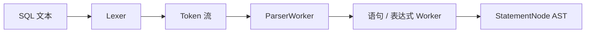

# 解析器

解析器负责把 SQL 文本转换为抽象语法树（AST）。它回答“输入是否符合 LiteDB 支持的 SQL 语法”，不访问 Catalog，也不判断数据库、集合或列是否存在。

## 组件结构



| 组件 | 职责 |
| --- | --- |
| `Lexer` | 跳过空白和注释，将字符序列识别为 Token |
| `Token` | 保存类型、文本和值以及行列位置 |
| `ParserWorker` | 根据语句首 Token 选择具体解析路径 |
| 语句 Worker | 解析 SELECT、INSERT、CREATE 等语句结构 |
| `ParserExpressionWorker` | 按优先级解析一元、二元和复合表达式 |
| AST | 按所有权组织完整语法结构并保留源码位置 |

顶层 `Parser` 只持有 SQL 文本和 Lexer，并把实际工作交给 `ParserWorker`。语句级 Worker 将不同语法拆开，避免单个解析函数承担所有 SQL 分支。

## Token 与源码位置

Lexer 将关键字、标识符、操作符、标点和字面量转换为 Token。每个 Token 携带 `TokenLocation`，错误发生时可以报告行和列。AST 节点将其转换为 `AstNodeLocation`，该位置随后贯穿绑定、规划、优化和执行错误。

关键字决定语句和子句结构；标识符仍只是用户输入的名称。Lexer 不会查询 Catalog，也不会把列名转换为内部 ID。

## AST 模型

AST 分为语句节点和表达式节点。当前语句节点覆盖：

- `SELECT`、`INSERT`、`UPDATE` 和 `DELETE`；
- `CREATE/DROP DATABASE`；
- `CREATE/DROP COLLECTION`；
- `CREATE/DROP INDEX`；
- `CREATE/DROP VINDEX`；
- `USE`、`SHOW` 和 `DESCRIBE`。

表达式节点包括字面量、列引用、通配符、向量、函数调用、一元和二元表达式，以及 `BETWEEN`、`IN`、`LIKE` 和别名表达式。

AST 尽量保存 SQL 的表面结构。例如 `documents.title` 仍以名称和限定符表达，函数调用仍保存函数名和参数；这些信息在 Binder 中才获得确定语义。

## 表达式解析

表达式解析必须处理运算符优先级和结合性，使：

```sql
a = 1 OR b = 2 AND c = 3
```

按照 `AND` 高于 `OR` 的优先级形成树，而不是简单按文本从左到右执行。括号可以显式改变结构；一元操作、比较、布尔操作以及 `BETWEEN`、`IN`、`LIKE` 等复合形式由表达式 Worker 统一组织。

Parser 只负责形成正确结构，不负责判断两个操作数能否比较，也不负责验证函数参数类型。

## 错误模型

解析错误使用 `ParserError`，主要类别包括：

- 空语句和词法错误；
- 意外的语句开头或 Token；
- 缺少标识符、表达式、字面量或数据类型；
- 空列表和无效整数字面量；
- 能够识别但尚未支持的语法。

错误携带最接近失败点的 Token 位置。Parser 不进行错误恢复：遇到第一个错误即返回失败，不继续尝试解析后续语句。

## 示例

```sql
SELECT title AS name
FROM documents
WHERE published = true
LIMIT 5;
```

可以概括为：

```text
SelectStatement
├── projections
│   └── AliasExpression
│       ├── ColumnReference(title)
│       └── name
├── from: documents
├── where
│   └── BinaryExpression(=)
│       ├── ColumnReference(published)
│       └── Literal(true)
└── limit: 5
```

此时 `documents`、`title` 和 `published` 是否存在仍未知，表达式的最终类型也尚未确定。

## 与 Binder 的边界

| Parser | Binder |
| --- | --- |
| 识别合法语法 | 验证语义 |
| 生成名称形式的 AST | 将名称解析为 ID |
| 区分字面量和操作符 | 推导和检查逻辑类型 |
| 不依赖数据库状态 | 依赖 Catalog 和会话状态 |
| 报告语法位置 | 报告对象、类型和约束错误 |

保持这条边界使同一 SQL 可以独立做语法测试，也防止 Parser 与易变化的在线 Catalog 耦合。

## 当前边界

- 顶层一次解析一条语句，不支持语句批次。
- Parser 不执行名称解析、隐式对象查找或类型检查。
- Parser 不做跨语句错误恢复。
- AST 是内部 C++ 对象，当前没有稳定的外部序列化格式。
- 只支持项目 SQL 参考章节列出的语法，不应将标准 SQL 的全部语法视为已实现。
