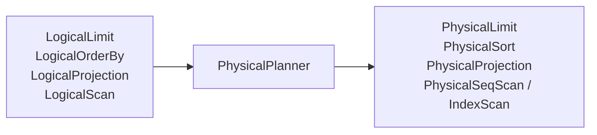

# 物理计划器

物理计划器将优化后的逻辑计划降低为执行器可以直接运行的物理计划。逻辑计划描述关系语义，物理计划确定具体访问路径和算子类型。

当前转换是确定性的规则映射，不在物理阶段重新执行成本搜索。

## 节点映射

| 逻辑节点 | 物理节点 | 说明 |
| --- | --- | --- |
| `LogicalScan` | `PhysicalSeqScan` | 没有索引提示时顺序读取集合 |
| `LogicalScan` | `PhysicalIndexScan` | 存在优化器生成的索引提示 |
| `LogicalVectorSearch` | `PhysicalVectorSearch` | 调用指定向量索引执行 Top-K |
| `LogicalFilter` | `PhysicalFilter` | 对输入记录求值谓词 |
| `LogicalProjection` | `PhysicalProjection` | 计算输出列 |
| `LogicalOrderBy` | `PhysicalSort` | 物化并排序输入 |
| `LogicalLimit` | `PhysicalLimit` | 应用偏移和数量限制 |

转换递归保持树形结构：



## 扫描选择

`LogicalScan` 默认转换为 `PhysicalSeqScan`。如果 Optimizer 已附加 `LogicalScanIndexHint`，则转换为 `PhysicalIndexScan`。

物理索引扫描保存：

- 数据库和集合 ID；
- 索引 ID、名称和类型；
- 等值或范围查找类型；
- 可选上下界；
- 每个边界是否包含端点。

Physical Planner 不再判断索引是否值得使用，也不重新查询 Catalog；选择依据完全来自优化后的逻辑计划。

## 向量搜索

`LogicalVectorSearch` 被降低为 `PhysicalVectorSearch`，保留：

- 集合、索引和向量列身份；
- 距离度量；
- 查询向量表达式；
- 可选过滤谓词；
- 请求候选数量。

实际 HNSW 查询、候选记录加载和过滤发生在 Executor 与 VectorIndexEngine 中。

## 语句计划

语句级映射包括：

- `QueryPlan` → `PhysicalQueryPlan`；
- `InsertPlan` → `PhysicalInsertPlan`；
- `UpdatePlan` → `PhysicalUpdatePlan`；
- `DeletePlan` → `PhysicalDeletePlan`；
- DDL 和元数据命令 → 对应 `PhysicalCommandPlan`。

`UPDATE` 和 `DELETE` 的输入逻辑树会递归转换为物理树；赋值表达式和目标集合身份随语句计划保留。

物理语句种类是 `DatabaseEngine` 和 `Executor` 的分派依据。DDL 由 `DatabaseEngine` 处理，其余查询、DML 和元数据读取命令通常交给 `Executor`。

## 计划中的数据

物理计划只保存执行所需的描述和值，不持有打开的游标、事务或结果记录。它可以包含：

- 稳定对象 ID 和名称；
- 已绑定表达式；
- 具体算子类别；
- 索引查找边界；
- DDL 参数和 Schema 定义；
- 源码位置。

运行时资源在执行阶段取得，因此生成物理计划本身不会读取记录或写入文件。

## 与 Optimizer 的边界

```text
Optimizer:
    发现 id >= 100 可使用 B+Tree
    → 在 LogicalScan 写入 index hint

Physical Planner:
    看到 index hint
    → 生成 PhysicalIndexScan

Executor:
    调用 IndexEngine 查找 RecordId
    → 回表取得记录并继续执行 Filter
```

这种划分使访问路径决策和执行机制相互独立。未来加入成本模型时，主要变化应位于 Optimizer，而不是让 Physical Planner 同时承担统计分析。

## 当前边界

- 物理计划生成是规则映射，没有候选物理计划枚举。
- 没有 Hash Join、Merge Join、Aggregate 或并行算子。
- `PhysicalSort` 是阻塞式物化排序，没有外部排序计划。
- 计划不预先打开存储或索引资源，也不保证这些资源在运行时可用。
- 当前没有稳定的物理计划序列化格式或公开 `EXPLAIN` 输出。
