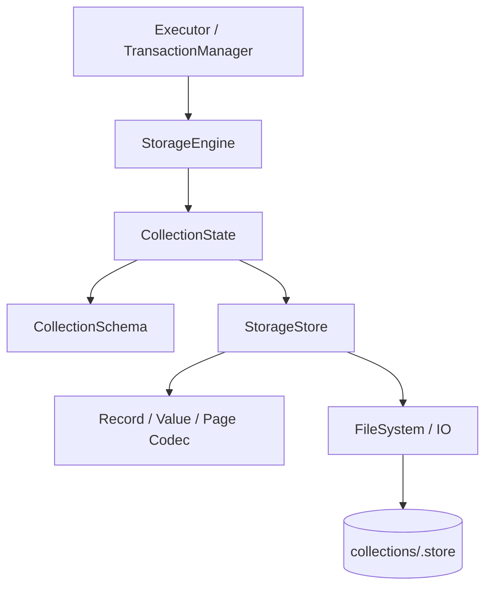
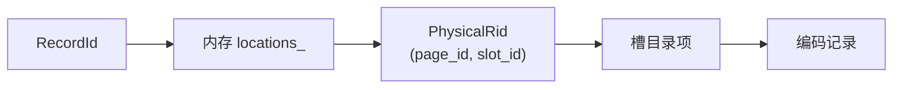
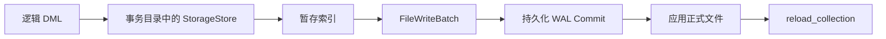

# 存储引擎总览

存储引擎负责管理集合记录的物理持久化：为每个集合维护独立存储文件，把逻辑记录编码到固定大小页面中，并提供按记录 ID 读取、写入和扫描的能力。



## 组件边界

存储模块可以分为四层：

| 层次 | 主要职责 |
| --- | --- |
| `StorageEngine` | 管理多个集合、保存运行时 Schema、校验记录、控制读写模式 |
| `StorageStore` | 管理单个集合文件、分配 RecordId、维护逻辑到物理位置映射 |
| 页面与记录 Codec | 定义槽页、记录和值的二进制格式及损坏校验 |
| `FileSystem` / IO | 提供定位读写、小端编码和 CRC32 |

`StorageEngine` 不负责 SQL 解析、索引维护或跨文件提交。标量索引和向量索引只保存 `RecordId`，通过 StorageEngine 获取实际记录；跨 Storage、Meta 和 Index 的原子性由 `TransactionManager + WAL` 提供。

## 每集合一个文件

集合文件路径为：

```text
<data-directory>/
└── collections/
    ├── 1.store
    ├── 2.store
    └── <collection-id>.store
```

文件名使用稳定的 `CollectionId`，而不是集合名称。集合改名不会改变物理文件身份。

每个文件只包含一个集合的记录和分配状态，不包含完整 Schema。Schema 的权威来源是 Catalog；数据库打开时先从 Catalog 构建 `CollectionSchema`，再用它打开对应存储文件。

## 逻辑记录与物理位置

存储层区分：

- `RecordId`：集合内稳定的逻辑记录标识；
- `PhysicalRid`：当前记录所在的 `(page_id, slot_id)`；
- `RecordData`：按 Schema 列顺序排列的 `Value` 数组。



记录更新时可以在原页重新放置，也可以移动到其他页面，但 `RecordId` 保持不变。索引因此引用逻辑 `RecordId`，不直接保存容易变化的页面槽位。

## 运行时打开模式

`StorageEngine` 有两种模式：

| 模式 | 用途 | 允许的公共操作 |
| --- | --- | --- |
| `LiveReadOnly` | 在线正式数据 | 打开、重载、读取、扫描 |
| `TransactionalStaging` | 事务暂存副本 | 创建、删除、插入、更新、删除，以及读取和扫描 |

正式在线 StorageEngine 拒绝直接修改。DML 先在事务目录中的暂存存储上执行，提交后再发布正式文件并重载在线集合。

这一边界使 StorageStore 的局部页面写入不必独自承担跨文件事务，但它也意味着不能绕过 TransactionManager 直接调用在线 StorageEngine 完成写事务。

## Schema 的作用

每个 `CollectionState` 按值保存：

```text
CollectionSchema + StorageStore
```

Schema 用于每次插入和更新前验证：

- 值数量与列数量一致；
- 非空约束；
- 运行时值类型；
- `VARCHAR(n)` 的字节长度；
- `VECTOR(n)` 的维度；
- 编码后的整条记录能够放入一个页面。

Schema 是从 Catalog 派生的稳定运行时布局，不是第二份 Catalog。它不包含标量或向量索引定义。

## 打开与重载

数据库启动时：

1. WAL 恢复先完成正式文件重做；
2. 从恢复后的 Catalog 加载集合 Schema；
3. 为每个集合打开 `<collection-id>.store`；
4. 扫描文件并重建内存位置目录和页面空间索引；
5. 再恢复标量索引和向量索引。

`reload_collection` 先成功打开新 Store，再替换当前 `CollectionState`。如果新文件损坏或无法打开，旧运行时状态不会被提前移除。

## 读写入口

StorageEngine 提供：

| 操作 | 行为 |
| --- | --- |
| `create_collection` | 创建集合文件并注册运行时状态 |
| `open_collection` | 打开已有集合文件 |
| `reload_collection` | 重新打开正式文件并替换单个集合状态 |
| `drop_collection` | 删除集合文件和运行时状态 |
| `get` | 按 RecordId 读取 |
| `insert` | 校验并分配新 RecordId |
| `update` | 校验并更新现有 RecordId |
| `erase` | 删除现有记录 |
| `scan` | 创建拥有结果快照的游标 |

写入入口只在 `TransactionalStaging` 模式可用。

## 与索引的关系

Storage 只保存记录，不自动更新索引。事务暂存执行 DML 时，TransactionManager 按同一条逻辑变更协调：

```text
Storage 记录
Scalar Index 键
Vector Index 节点
```

标量索引使用 `(key, RecordId)`，向量索引使用 `(vector, RecordId)`。记录移动页面时索引无需修改；记录内容改变导致索引键变化时，由 IndexEngine 或 VectorIndexEngine 处理。

## 与事务的关系

`StorageStore::write_page` 和 `write_header` 是定位写入，不构成独立事务，也不会自行生成 WAL。一次记录更新可能改写页面、移动记录或更新文件头。

数据库级提交由事务层完成：



因此：

- StorageStore 负责本领域文件格式和局部一致性检查；
- TransactionManager 负责跨文件原子提交；
- WAL Commit 持久化后不能回滚，只能通过恢复完成应用。

完整协议将在[事务与恢复](../../transaction_and_recovery/README.md)中说明。

## 当前边界

- 一个集合对应一个完整存储文件。
- 页面固定为 4096 字节。
- 一条记录必须完整放入一个页面，不支持溢出页。
- 在线 StorageEngine 为只读。
- 没有 Buffer Pool、页缓存、Pin/Unpin 或淘汰策略。
- 打开文件时扫描所有数据页，重建内存目录。
- 扫描游标会物化完整记录快照，不是流式页游标。
- Storage 不维护标量或向量索引。
- StorageStore 本身不是 WAL 或事务边界。

集合生命周期和 Schema 校验详见[StorageEngine](../storage_engine/README.md)，页面分配和 CRUD 详见[记录与页面](../records_and_pages/README.md)，磁盘布局详见[存储文件格式](../file_format/README.md)。
