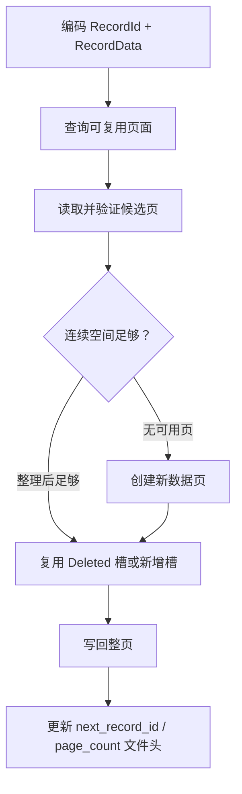

# 记录与页面

`StorageStore` 管理一个集合的记录分配和固定大小数据页。它维护稳定的逻辑 `RecordId`，并在内存中把 RecordId 映射到可变化的物理页面槽位。

## RecordId 与 PhysicalRid

```text
RecordId     = uint64 逻辑标识
PhysicalRid  = (uint32 page_id, uint16 slot_id)
```

`next_record_id_` 从 1 开始单调增加。0 不作为有效记录 ID。删除记录不会回收 RecordId；重新插入会获得新 ID。

位置目录使用：

```text
map<RecordId, PhysicalRid> locations_
```

它只存在于内存中，打开 Store 时通过扫描所有活动槽重建。使用有序 `map` 也使扫描快照按 RecordId 顺序组装。

## 槽页结构

每个数据页固定为 4096 字节：

```text
+-------------------------------+ 0
| Page Header (24 bytes)        |
+-------------------------------+ 24
| Slot 0 (8 bytes)              |
| Slot 1 (8 bytes)              |
| ...                           |
+-------------------------------+ free_start
|                               |
|       连续空闲空间             |
|                               |
+-------------------------------+ free_end
| Record Payload N              |
| ...                           |
| Record Payload 0              |
+-------------------------------+ 4096
```

槽目录从页头后向高地址增长，记录 Payload 从页尾向低地址增长。`free_start` 与 `free_end` 之间是当前连续空闲空间。

## 槽目录项

每个槽占 8 字节：

| 字段 | 大小 | 含义 |
| --- | ---: | --- |
| offset | 2 | Payload 在页内的起始位置 |
| length | 2 | Payload 长度 |
| state | 1 | Active 或 Deleted |
| reserved | 3 | 必须为零 |

删除记录时槽状态改为 Deleted。槽 ID 保留，后续插入优先复用 Deleted 槽，避免继续扩张槽目录。

## 页面空间索引

StorageStore 为每个页面维护：

- `contiguous`：当前连续空闲空间；
- `reclaimable`：连续空闲空间加已删除 Payload；
- `has_deleted_slot`：是否可以免去新增槽目录项。

同时使用：

```text
set<(reclaimable_bytes, page_id)> free_space_index_
```

插入时从满足估算空间的页面开始尝试，而不是每次顺序扫描全部页面。

这个索引是内存加速结构，打开 Store 时从每个页面的槽目录重建。

## 页内整理

删除记录后，旧 Payload 仍可能占据页尾区域，只是槽被标记为 Deleted。页面的可回收空间可能大于连续空闲空间。

当候选页面的连续空间不足但回收后足够时，StorageStore 执行页内整理：

1. 创建新的空白页缓冲区；
2. 保留槽 ID 和活动槽顺序；
3. 从页尾重新紧密排列活动 Payload；
4. 清零已删除槽的 offset 和 length；
5. 更新 `free_start`、`free_end`；
6. 增加 generation；
7. 重算页面 CRC32。

整理不会改变 RecordId，也不会改变活动记录的 SlotId，但会改变 Payload offset。

## 插入

插入流程为：



具体顺序：

1. 使用当前 `next_record_id_` 编码记录；
2. 优先尝试指定或空间索引中的已有页面；
3. 必要时整理候选页；
4. 复用 Deleted 槽或追加新槽；
5. 没有页面可用时追加新页；
6. 更新 `locations_`；
7. 增加 `next_record_id_`；
8. 重写文件头。

一条记录必须连同页头和一个槽完整放入单页。

## 更新

更新保留 RecordId：

1. 通过 `locations_` 找到旧 PhysicalRid；
2. 读取并验证旧页面；
3. 将旧槽标记为 Deleted；
4. 整理旧页面；
5. 尝试把新记录放回旧页面；
6. 若失败，先写回删除后的旧页面，再在其他页放置；
7. 更新 RecordId 对应的 PhysicalRid。

```text
RecordId 不变
PhysicalRid 可能变化
```

这正是索引保存 RecordId 而不是 PhysicalRid 的原因。

## 删除

删除操作：

1. 通过位置目录找到页面槽；
2. 把槽状态改为 Deleted；
3. 增加页面 generation；
4. 重算页面 CRC；
5. 写回完整页面；
6. 更新空间索引；
7. 从 `locations_` 移除 RecordId。

删除不会立即缩小文件，也不会减少 `page_count`。空间通过后续复用和整理回收。

## 读取

按 RecordId 读取时：

1. 在 `locations_` 查找 PhysicalRid；
2. 定位读取完整页面；
3. 校验页面结构和 CRC；
4. 检查槽仍为 Active；
5. 解码槽指向的记录 Payload。

当前没有数据页缓存，因此重复读取同一页会重复执行文件读取和校验。

## 扫描

`scan()` 会：

1. 每个数据页读取一次；
2. 校验并解码全部 Active 槽；
3. 检查没有重复 RecordId；
4. 与 `locations_` 交叉检查；
5. 按 RecordId 组装记录向量；
6. 返回拥有该向量的 `StorageCursor`。

Cursor 的 `next()` 返回下一条已物化记录；到末尾返回空 `optional`。

这提供了独立于后续 Store 变化的内存快照，但代价是扫描开始时读取全文件并占用与结果集大小相关的内存。

## 局部写入与失败边界

StorageStore 以页面为单位定位写入，但一次逻辑操作可能包含多个写步骤。例如：

- 新页插入：写新页，再写文件头；
- 跨页更新：写旧页删除状态，再写新位置；
- 插入：写数据页，再推进 `next_record_id` 文件头。

这些步骤没有独立 WAL，也没有单 Store 回滚协议。正式数据库写入必须发生在事务暂存副本上；暂存失败可以丢弃，提交时由 WAL 协调完整文件后像。

不能把“一个页面写入成功”解释为逻辑记录已经可靠提交。

## 当前边界

- 没有溢出页或跨页记录。
- 没有页缓存和脏页管理。
- 没有页级锁或并发控制。
- 页面只追加，不执行尾部页面回收和文件缩小。
- RecordId 不复用。
- 删除采用槽标记，空间延迟复用。
- 扫描是全量物化，不是惰性页面迭代。
- PhysicalRid 不是对上层公开的稳定标识。
