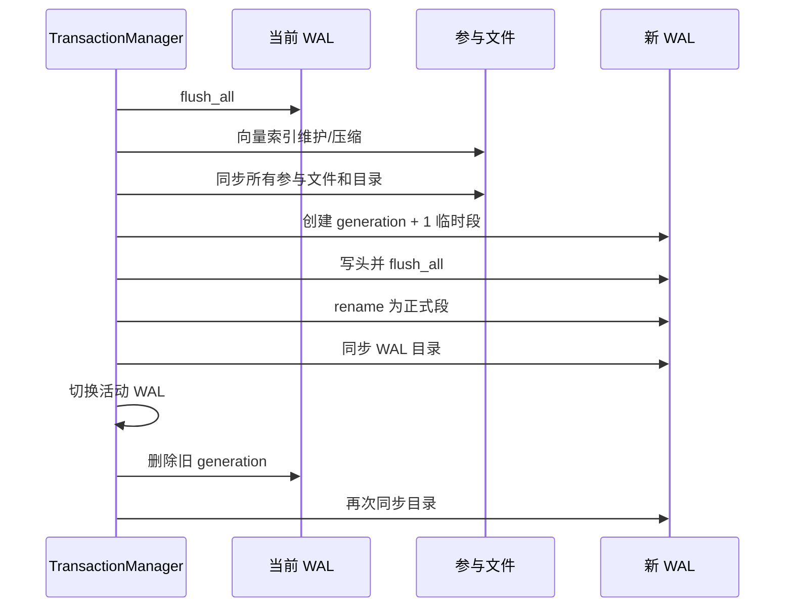

# Checkpoint

Checkpoint 的目标是先确认所有已提交结果已经持久化到参与文件，再发布一个空的新 WAL generation，最后删除旧段。

它不是把未提交事务刷盘，也不改变提交语义。

## 执行顺序

checkpoint 与普通写事务共用单写者锁：

新 WAL 头记录 checkpoint 时已经分配的最大事务 ID。

## 参与者同步

轮换 WAL 前会：

1. 同步当前 WAL；
2. 运行向量索引 checkpoint，按阈值压缩 HNSW 文件；
3. 打开并同步集合、标量索引、向量索引和 Meta 等参与文件；
4. 同步相关目录与数据根目录。

只有这些动作成功，旧 WAL 的 redo 才不再是恢复正式文件所必需。

## WAL 轮换

新一代 WAL 先写入 `.tmp` 文件并完全同步，再 rename 为正式段、同步目录，之后才切换内存中的活动 WAL。

切换完成后删除旧 generation；若有旧段删除失败，它会保留并反映在 retained segment 统计中。当前打开逻辑始终选择最高 generation，因此已经发布的新段仍是活动段。

轮换结果不确定时会设置 `recovery_required`。系统不会在无法判断活动 WAL 状态时继续接收写事务。

## 崩溃边界

| 崩溃位置 | 重启时的安全依据 |
| --- | --- |
| 参与文件同步前 | 旧 WAL 仍在 |
| 新临时 WAL 同步前 | 旧正式 WAL 仍是最高正式段 |
| rename 后、切换前 | 新正式段已包含 checkpoint ID |
| 切换后、删除旧段前 | 打开时选择更高 generation |
| 删除旧段后 | 新 WAL 和目录已经同步 |

## 自动 checkpoint

数据库可在提交后根据 WAL 大小阈值触发自动 checkpoint；阈值为 0 时禁用。自动 checkpoint 是 durable commit 之后的维护动作，失败不等同于撤销刚完成的事务。

## 与 HNSW 压缩的区别

事务 checkpoint 会调用向量索引 checkpoint，但两者概念不同：

- WAL checkpoint 建立“参与文件已持久化，可以淘汰旧 redo”的边界；
- HNSW checkpoint/压缩重建图文件以回收墓碑和历史提交帧。

二者恰好在同一单写者维护窗口内协作，但不能互换。
