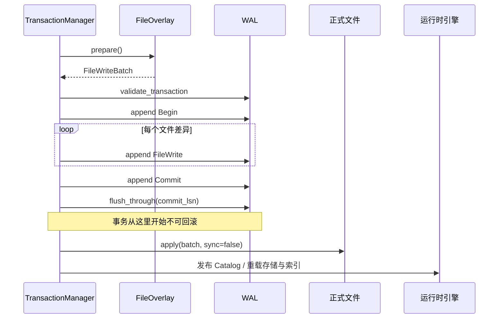

# 提交协议

## 完整顺序



## 1. Prepare

事务进入 `Preparing`，在 `.transactions/txn_<id>` 对应的覆盖层中执行全部变更。失败时：

- 正式文件未变；
- WAL 尚未记录该事务；
- 事务被标记 rollback-only 并 abort；
- 暂存状态由清理对象回收。

## 2. WAL 预算验证

`validate_transaction` 在追加任何记录前检查：

- 单条记录大小；
- 整个 WAL 扫描预算；
- 记录数量；
- 大小计算是否溢出。

这样可避免写到事务中途才发现它永远无法按配置的恢复限制解码。

## 3. 追加 Begin 与 FileWrite

事务进入 `Committing`，依次追加：

```text
Begin(txn)
FileWrite(txn, write 1)
...
FileWrite(txn, write n)
```

这时正式文件仍未修改。若在追加 `Commit` 之前明确失败，事务可中止；恢复会忽略没有完整提交记录的事务。

## 4. 追加并刷盘 Commit

追加 `Commit` 后，调用 `flush_through(commit_lsn)`。两类失败必须谨慎区分：

- `Commit` 追加返回失败：追加结果可能不确定，数据库进入 `recovery_required`；
- 提交刷盘返回失败：持久化结果也不确定，同样必须恢复。

刷盘成功后，事务状态转为 `Committed`。这是持久化承诺点。

## 5. Apply

`FileWriteBatch::apply(..., sync=false)` 把 redo 差异应用到正式目标。这里不逐个文件同步，因为持久 WAL 已经能够在崩溃后重复应用相同 after-image。

apply 必须可幂等重放：

- Overwrite 写入相同字节；
- Replace 用完整 after-image 替换；
- Delete 对目标删除；
- Truncate 调整到同一长度。

应用中途失败不会回滚已写文件，而是进入 `recovery_required`，由下次恢复重新执行完整已提交批次。

## 6. 运行时发布

Catalog 事务先发布已提交快照；随后重载受影响的 storage、标量索引和向量索引。运行时重载失败同样不会否定已经持久化的事务，而是要求恢复。

## 失败边界

| 失败位置 | 是否已持久提交 | 处理 |
| --- | --- | --- |
| prepare / WAL 预算 | 否 | abort |
| Begin / FileWrite 追加 | 否 | abort |
| Commit 追加结果不确定 | 未知 | recovery required |
| Commit flush 结果不确定 | 未知 | recovery required |
| Commit flush 成功后 | 是 | 只能 redo / recovery |
| apply 或 reload | 是 | recovery required |

“返回错误”不总是表示事务未提交。调用方必须根据错误类别识别 `RecoveryRequired` 或 `CommittedApplyFailed`。
