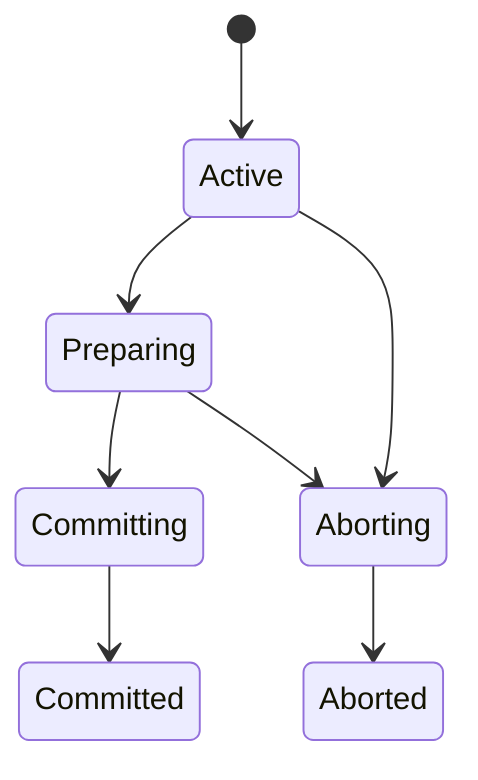

# 事务模型与暂存

## 单写者模型

`begin_implicit` 获取 `TransactionManager` 的 writer mutex，这把锁由 `TransactionContext` 持有，直到提交、回滚或进入需要恢复的终止状态。

单写者使当前核心层的隔离模型等价于串行执行写事务。`IsolationLevel` 目前只有 `Serializable`；代码尚未实现读未提交、读已提交或可重复读等多级隔离。

## TransactionContext

上下文保存：

- 单调递增的事务 ID；
- 当前状态；
- 第一条、最后一条和提交 WAL 的 LSN；
- DML 行写集合；
- 可选的 DDL Catalog 快照；
- rollback-only 标记与失败原因；
- writer lock 的所有权。

状态主路径为：



`Committing` 或 `Committed` 事务不能调用普通 abort，因为此阶段可能已经追加了提交记录。

## DML 写集合

三类 `RowMutation` 分别保存：

| 变更 | before | after |
| --- | --- | --- |
| Insert | 无 | 新记录 |
| Update | 旧记录 | 新记录 |
| Delete | 旧记录 | 无 |

插入暂存时还没有正式 `RecordId`；准备阶段在 staged `StorageEngine` 中执行插入后获得 ID，并用它同步维护 staged 标量和向量索引。

## DDL 快照

`stage_catalog` 接受完整的 `MetaSnapshot`。它要求当前事务没有 DML 写集合，也没有另一个 Catalog 快照，并会先构建 Catalog 状态以验证引用和约束。

这种互斥使当前事务要么是行变更事务，要么是 Catalog 事务，避免在同一个准备路径中混合两套语义。

## 文件覆盖层

`TransactionFileOverlay` 把“逻辑暂存目录”映射到正式数据目录的只读基础状态。对暂存文件系统的写入只修改覆盖层中的 4 KiB 脏块和逻辑文件长度，不直接写正式文件。

```text
读取 = 脏块优先，否则读取正式文件
写入 = 修改覆盖层脏块
删除 = 标记逻辑文件删除
截断 = 修改逻辑长度并清理越界脏块
```

`export_batch()` 比较覆盖层最终状态与基础文件，生成 `Overwrite`、`Truncate` 或 `Delete` 等物理写入。相邻覆盖写可在批处理中合并。

## 准备 DML

准备阶段为受影响的集合打开 staged storage、标量索引和向量索引，然后按写集合顺序执行真实的领域操作：

1. 验证并准备索引键；
2. 修改 staged 集合文件；
3. 修改 staged 标量索引；
4. 修改 staged 向量索引；
5. 最后从 overlay 导出文件差异。

唯一约束、记录不存在、维度不匹配等错误都会在正式 WAL 提交前出现。

## 准备 DDL

DDL 准备会在覆盖层中保存新 Catalog，打开或创建新快照所需的集合，构建新索引，并删除旧快照中已不存在的物理目标。最终同样导出一个 `FileWriteBatch`。

暂存目录只是逻辑路径和事务工作区。提交的真正输入是可重放的物理文件批次。
