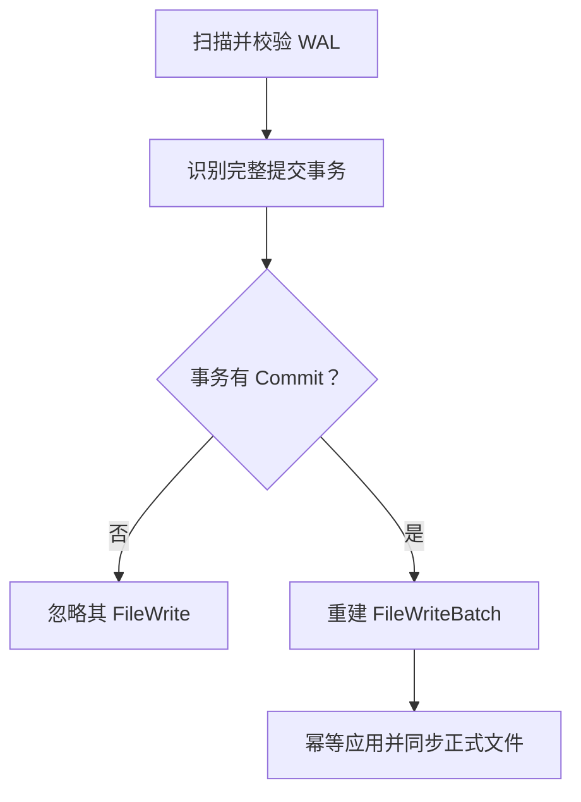

# 崩溃恢复

数据库打开时，`RecoveryManager` 扫描活动 WAL，验证事务记录序列，并只重放具有完整 `Commit` 的事务。

## 两遍处理

第一遍建立每个事务的日志状态：

```text
Begin -> zero or more FileWrite -> Commit
```

以下情况视为损坏：

- 重复 Begin；
- Begin 之前出现 FileWrite；
- Commit 之后仍有 FileWrite；
- 缺少 Begin 的 Commit；
- 重复 Commit；
- Begin 或 Commit 带有 payload。

第二遍再次按 WAL 顺序遍历，只为已提交事务收集 `FileWrite`。遇到对应 `Commit` 时立即以 `sync=true` 应用该事务的批次。

## Redo-only 恢复



恢复不需要判断事务是否已经部分应用。after-image 操作可以重复执行，所以：

- 完全未应用的事务会被补写；
- 应用了一部分的事务会被完成；
- 已全部应用的事务会被再次写成相同状态。

这正是提交阶段在 WAL durable 后可以用 `sync=false` 应用参与文件的基础。

## WAL 尾部

扫描默认允许截断未完成的物理尾部。例如进程在追加记录中途崩溃，只要最后一个完整记录之前均合法，就截断到 `valid_size`。

尾部修复不能掩盖中间损坏或完整记录的 CRC 错误；这类问题会停止恢复。

## 事务 ID 连续性

恢复结果同时报告 WAL 中出现的最大事务 ID，并与当前 WAL 头中的 checkpoint transaction ID 取最大值。新 `TransactionManager` 从其后继续分配事务 ID，避免 checkpoint 清空旧记录后重复使用 ID。

## 恢复后的运行时

恢复首先修复物理文件。随后数据库从已恢复的 `meta.lmeta` 打开 Catalog、集合存储和索引。索引自身还会执行格式或内容验证；向量索引在可重建错误下可以从集合数据重建。

因此恢复顺序遵循：

```text
WAL redo -> 打开 Catalog -> 打开 Storage -> 恢复索引 -> 接受新事务
```

当在线提交出现持久化结果不确定或 committed apply 失败时，`recovery_required` 会阻止新事务和 checkpoint，直到走完这条恢复路径。
