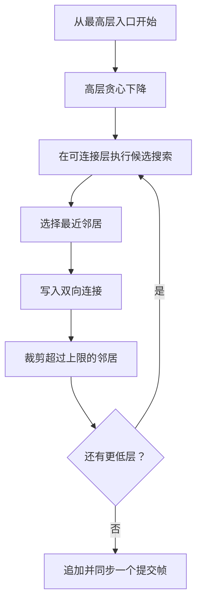

# HNSW 图索引

HNSW 是分层的近似最近邻图。每个活动记录对应一个节点，节点保存原始向量、随机层级和每一层的邻居列表。

## 节点与图元数据

`HnswNode` 包含：

- 单调递增的节点 ID；
- `RecordId`；
- 完整向量；
- 最高层级；
- 删除标记；
- 从第 0 层到最高层的邻居列表。

图元数据保存下一个节点 ID、入口节点、全图最高层、活动节点数和提交帧序号。

同一 `RecordId` 在任意时刻最多有一个活动节点。更新向量时，旧节点成为墓碑，新向量获得新的节点 ID。

## 随机层级

节点层级由 `random_seed` 和节点 ID 确定性地产生，呈指数衰减，并限制在 63 层以内。确定性的层级选择使相同数据、顺序和参数的重建具有可重复性。

## 插入



第 0 层的邻居上限为 `2 × max_neighbors`，更高层为 `max_neighbors`。构建候选宽度由 `ef_construction` 控制。新节点高于当前最高层时，它成为新的入口点。

一次插入不仅更新新节点，也可能更新多个已有邻居节点；这些变更作为同一个 HNSW 提交帧写入。

## 搜索

搜索先在最高层开始贪心移动，逐层下降到第 0 层。第 0 层使用候选集合扩大搜索：

```text
ef = max(top_k, ef_search_default)
```

实现还会考虑墓碑数量，在容量允许时扩大候选范围，避免已删除节点过多挤占最终候选。输出会过滤墓碑，并返回最多 `top_k` 个活动记录。

当前请求对象只包含 `top_k`，调用方不能为单次查询覆盖 `ef_search_default`。

## 删除

删除不立即从所有邻居列表中拆除节点，而是把目标节点标记为 `deleted`，活动计数减一并追加提交帧。

墓碑仍可能参与图的导航，但不会出现在最终结果中。这样可避免删除时大范围重写图；代价是物理节点和文件大小持续增长，需要周期性压缩。

## 近似性与参数

主要参数含义：

| 参数 | 影响 |
| --- | --- |
| `max_neighbors` | 每层连接数量及图密度 |
| `ef_construction` | 构建时的候选宽度 |
| `ef_search_default` | 查询第 0 层的默认候选宽度 |
| `random_seed` | 确定性层级分布 |

更大的邻居数和 `ef` 通常提高召回率，但增加构建时间、查询距离计算、内存与磁盘占用。实现提供的是结构和参数机制，不承诺对所有数据分布达到固定召回率。
