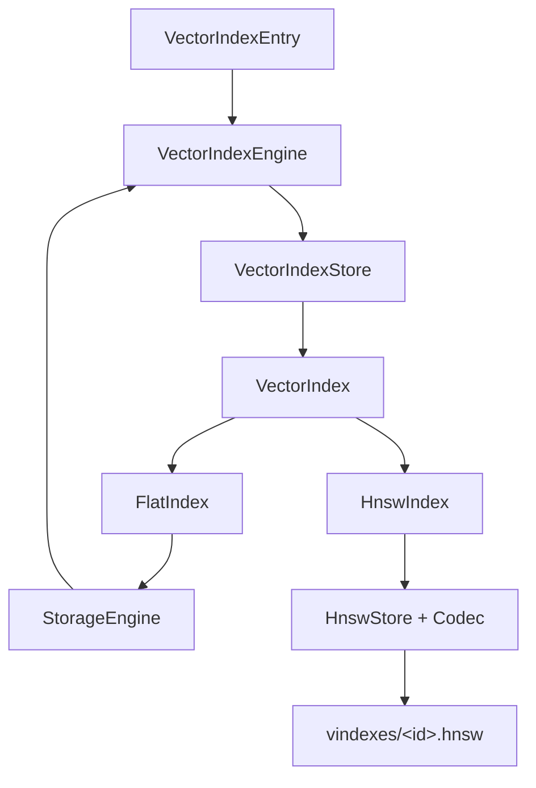

# 向量索引总览

LiteDB 的向量索引把固定维度的 `VECTOR(n)` 列映射为最近邻查询能力：

```text
查询向量 + top_k -> [(RecordId, distance), ...]
```

系统同时包含精确扫描后端 `FlatIndex` 和持久化近似最近邻后端 `HnswIndex`。当前 Catalog 与 SQL 创建路径只发布 HNSW 索引；Flat 后端是内部可用的精确基线，不对应独立的持久化索引文件。

## 分层结构



| 组件 | 责任 |
| --- | --- |
| `VectorIndexEngine` | 解释元数据、管理生命周期、维护 DML、恢复与压缩 |
| `VectorIndexStore` | 组合描述符和后端，统一维度检查 |
| `VectorIndexKey` | 验证向量非空且元素均为有限值 |
| `FlatIndex` | 扫描集合并精确计算所有距离 |
| `HnswIndex` | 构建和搜索分层近邻图 |
| `HnswStore` | 以内存图加追加提交帧的方式持久化 |

## 两种后端

### Flat

Flat 搜索直接扫描集合记录，不物化索引条目。插入只验证维度，删除为空操作，`size()` 始终为 0。它返回精确的 top-k 结果，但查询成本随集合记录数线性增长。

### HNSW

HNSW 把每条非空向量记录物化为图节点，通过高层稀疏图快速接近查询区域，再在第 0 层扩大候选集合。它显著减少距离计算，但属于近似检索，召回率受图参数和搜索宽度影响。

## 生命周期

创建 HNSW 索引时，系统在 `.building` 临时文件中扫描集合并构图，完成后原子替换为正式文件，再重新打开。数据库恢复时会校验文件描述符、提交帧、图结构以及索引内容与集合记录的一致性。

文件缺失、损坏、版本不支持、校验和失败或索引陈旧时，恢复路径可从集合数据重建索引，而不是直接发布不可信的图。

## DML 维护

与标量索引相同，记录写入分成 `prepare_*` 与 `on_*`：

- `NULL` 不进入向量索引；
- 非空值必须是正确维度的有限向量；
- 插入生成新节点；
- 删除把节点标记为墓碑；
- 更新在向量改变时删除旧节点并插入新节点；
- 多索引失败时尝试局部补偿。

HNSW 每次图变更都会追加并同步一个提交帧。该帧是向量索引文件自己的持久化单位，不替代数据库跨文件事务。

## 当前实现边界

- Catalog 只接受 HNSW 类型；
- 一个向量索引只覆盖一个 `VECTOR(n)` 列；
- `NULL` 被跳过；
- 查询只接受 `top_k`，尚未公开按请求覆盖 `ef_search` 的接口；
- HNSW 删除使用墓碑，不立即整理全部邻接边；
- checkpoint 只在达到阈值时重建并压缩 HNSW 文件；
- 跨集合数据、标量索引、向量索引和 Catalog 的原子性属于事务与 WAL 层。

## 阅读顺序

1. [向量索引引擎](../vector_index_engine/README.md)
2. [向量键、距离与精确扫描](../distance_and_flat/README.md)
3. [HNSW 图索引](../hnsw/README.md)
4. [持久化、恢复与压缩](../persistence_and_recovery/README.md)
