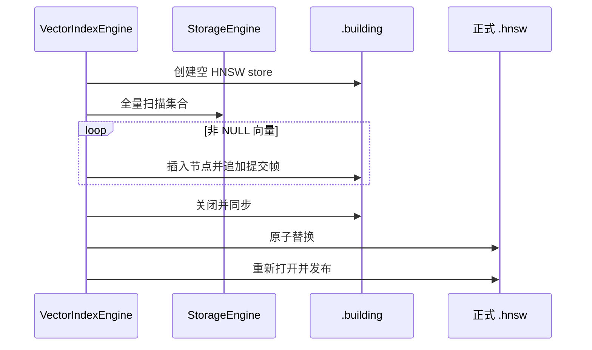

# 向量索引引擎

`VectorIndexEngine` 是向量索引子系统的运行时协调器。它从 `VectorIndexEntry` 和 `CollectionSchema` 生成稳定的 `VectorIndexDescriptor`，再管理具体后端。

## 描述符验证

创建或恢复索引前会检查：

- 元数据中的集合 ID 与模式一致；
- 目标列存在且类型为 `VECTOR(n)`；
- 列维度与索引维度相同且大于 0；
- 距离度量为 L2、内积或余弦之一；
- HNSW 参数位于支持范围；
- `ef_construction >= max_neighbors`；
- 当前 Catalog 索引种类为 HNSW。

描述符还记录列序号，使 DML 路径可以直接从 `RecordData` 中提取向量。

## 创建与发布

启动时会先清理遗留的 `.building` 和 `.compact` 临时文件。正式文件只有在构建完成后才出现，避免把半成品当作可恢复索引。

## 恢复策略

`restore_all` 在临时引擎中恢复全部索引，全部成功后才替换当前映射。单个集合的 `reload_collection` 也先恢复新集合索引，再替换旧状态。

HNSW 打开后不仅验证文件结构，还会与 `StorageEngine` 中的记录核对。以下错误被视为可重建：

- 正式文件缺失；
- 格式损坏；
- 版本不支持；
- 校验和错误；
- 图结构损坏；
- 索引内容陈旧。

遇到这些错误时，引擎从集合记录重新构建。其他错误直接返回，不会把部分状态发布到运行时。

## DML 两阶段维护

`prepare_insert`、`prepare_update`、`prepare_delete` 提取每个相关索引的向量键。`NULL` 表示无索引入口。

应用阶段：

- 插入：为 `RecordId` 创建节点；
- 删除：按 `RecordId` 标记活动节点为已删除；
- 更新：键改变时删除旧节点并插入新节点。

如果一个集合有多个向量索引，后续操作失败会尝试撤销此前修改。无法可靠补偿时，集合会被标记为需要恢复；此后相关维护或查询会拒绝继续使用该运行时状态，直到集合索引被重新加载。

这种 dirty 标记把“可能已经不一致”显式化，但数据库级崩溃一致性仍由外层事务协议保证。

## 查询和观测

`search(index_id, query, request)` 把请求路由到后端。只读视图可返回：

- 索引、集合、列 ID；
- 列序号；
- 索引类型和距离度量；
- 向量维度；
- 活动条目数。

维护统计还汇总 HNSW 的提交帧数、物理节点数、活动节点数、墓碑数、文件字节数，以及最近一次压缩回收的字节和耗时。

## 所有权边界

向量索引引擎拥有后端运行时实例和索引文件生命周期，但不拥有集合数据文件、Catalog 提交或 WAL。Flat 后端甚至只保存对 `StorageEngine` 的只读引用；HNSW 后端才拥有独立持久化文件。
